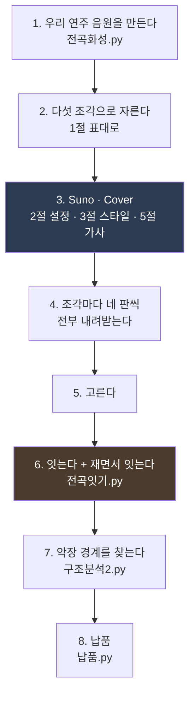

# Suno 프롬프트 최종본 — 실제로 쓴 것 전부

**승인된 전곡(`전곡 E`, 10:19.84)을 만들어 낸 프롬프트와 설정을 한곳에 모은다.**

| 항목 | 내용 |
|---|---|
| 관련 문서 | [17 Suno 설계](<17. Suno 로 음원 만들기 — 설계.md>) · [19 조각을 전곡으로 잇는다](<19. 조각을 전곡으로 잇는다 — Suno 의 역할과 한계.md>) · [21 음악이 끝났다](<21. 음악이 끝났다 — 승인 기준선.md>) · [07 작곡 계획](<07. 작곡 계획.md>) 11장 |
| **버전** | **v5.18** (2026-08-28) |
| 작성 | Claude |
| 성격 | **최종본 기록.** 「이렇게 하려 했다」가 아니라 **「이것으로 나왔다」** |

### 개정 이력

| 버전 | 일자 | 변경 |
|---|---|---|
| **v5.17** | 2026-08-25 | 최초 작성 |

---

## 0. 이 문서가 왜 따로 필요한가

**`17` 은 설계 문서다.** 「악장별 프롬프트 열」이 적혀 있는데
**그건 자체 합성 9분 40초 판의 시각 기준**이고, **실제로는 악장 단위가 아니라
부 단위로 뽑았다.**

**실제로 쓴 프롬프트 다섯 개는 산출물 폴더 안의 `.txt` 파일에 흩어져 있었다.**

> **★ 승인된 곡을 다시 만들려면 이 다섯 개가 필요한데,
> 그것들이 문서 어디에도 모여 있지 않았다.**

**그래서 여기 모은다.** `17` 은 **왜 그렇게 정했나**를 갖고,
이 문서는 **무엇을 실제로 넣었나**를 갖는다.

---

## 목차

- [1. 전체 구조 — 다섯 조각](#1-전체-구조--다섯-조각)
- [2. 설정값 — 매번 같음](#2-설정값--매번-같음)
- [3. ★ 스타일 프롬프트 다섯 — 전문](#3--스타일-프롬프트-다섯--전문)
- [4. 빼달라고 한 것](#4-빼달라고-한-것)
- [5. 가사 — 여덟 행이 전부다](#5-가사--여덟-행이-전부다)
- [6. 채택판 곡 ID](#6-채택판-곡-id)
- [7. ★ 실제로 겪은 함정 다섯](#7--실제로-겪은-함정-다섯)
- [8. 다시 만들려면](#8-다시-만들려면)

---

## 1. 전체 구조 — 다섯 조각

**Suno 는 10분을 한 번에 못 만든다.** 나눠 뽑고 이었다.

**처음에는 네 조각(1~4부)으로 설계했는데, 0악장을 다시 만들면서 다섯이 됐다.**

| 조각 | 곡에서 | 길이 | 들어 있는 악장 | 가사 |
|---|---|---|---|---|
| **1부a** | 0:00~0:50 | 50초 | **0 프롬나드** | 없음(연주만) |
| **1부b** | 0:50~2:40 | 110초 | 1 마드리드 · 2 변주 I · 3 세고비아 | **2악장에 한 행** |
| **2부** | 2:40~5:25 | 165초 | 4 세비야 · 5 변주 II · 6 론다 | **5악장에 한 행** |
| **3부** | 5:25~8:45 | 200초 | 7 그라나다 · 8 바르셀로나 | **없음** |
| **4부** | 8:45~9:40 | 55초 | 9 The Great Gate | **네 행** |

> **왜 악장 열 개로 안 나눴나** — **2·5악장이 15초뿐이라 Suno 가 곡으로 못 만든다.**
> 그리고 **이음매가 아홉 곳이 된다.** 부 단위면 세 곳뿐이다.

**위 시각은 자체 합성판 기준이다.** Suno 가 돌려준 것은 길이가 달라졌고,
**최종 전곡은 10:19.84** 다. 악장 경계 실측은
[`구간표 - 전곡 E 10m20s.md`](<산출물/20260822 - 0악장을 다시 만든다/README.md>)가 갖는다.

---

## 2. 설정값 — 매번 같음

| 항목 | 값 | 왜 |
|---|---|---|
| **기능** | **`Cover`** | **올린 소리를 바탕으로 새로 만든다.** `Edit vocals` 는 목소리만 얹는 것이라 다르다 |
| **올리는 것** | **우리가 만든 연주 음원** (`전곡화성.py` 렌더) | **빈 종이에서 시키면 우리 곡이 아니라 Suno 의 곡이 나온다** |
| `Vocal Gender` | **`Male`** | 여행자는 남자다. **안 고르면 여자가 나올 수 있다** |
| `Weirdness` | **15%** | 기본 50%. **창법이 곧고 담담해야 한다** |
| `Style Influence` | **75%** | 기본 50% |
| **`Audio Influence`** | **80%** | **우리 화성을 따르되 자기 방식으로 연주할 여지** |
| **`Duration`** | **`Custom` — 조각마다 지정** | **`Auto` 로 두면 길이가 흔들린다** |

**`Duration` 값** — 1부a **50초** · 1부b **110초** · 2부 **165초** · 3부 **200초** · 4부 **55초**

> **★ `Audio Influence` 80% 의 정본은 [17](<17. Suno 로 음원 만들기 — 설계.md>) 6절이다.**
> 한때 입력지에 70% 라고 적혀 있어 두 곳이 어긋난 적이 있다(2026-08-21 정정).

---

## 3. ★ 스타일 프롬프트 다섯 — 전문

**아래가 실제로 `Styles` 칸에 넣은 것 그대로다.**

### 3.1 공통으로 지킨 것

**다섯 개 전부 같은 뼈대로 썼다.**

| 순서 | 무엇 |
|---|---|
| **①** | **시대와 질감** — 1970s symphonic progressive rock, analog and warm, tape saturation |
| **②** | **편성** — **베이스를 맨 앞에 적는다.** 이 곡의 주역이기 때문 |
| **③** | **박자와 조성** — 5/4 와 6/4 교대, B♭ 장조 |
| **④** | **구간별 흐름** — *"Three sections: First… Second… Third…"* |
| **⑤** | **끝에 성격 한 줄** — 「어떤 느낌이어야 하는가」 |

> **★ 「하지 말 것」은 4절에 따로 몰아 적었다.**
> **금지를 스타일 앞에 섞으면 아무것도 안 한다.**

### 3.2 1부a — 0악장 프롬나드 (50초)

```
1970s symphonic progressive rock, analog and warm, tape saturation, wide dynamic
range. Rickenbacker bass played with a pick, front and centre as a lead voice.
Grand piano, Hammond organ through a Leslie, strings, quiet drums well behind the
beat. Meters alternate 5/4 and 6/4. B-flat major.

Opens with the bass alone for the first ten seconds: a walking eighth-note line
that never stops, no melody yet, just steps. Then grand piano, Hammond organ and
strings enter together and the main theme appears for the first time, unhurried at
quarter = 100, one chord lasting about four seconds. The theme returns four times,
each time a little different. Quiet drums join only in the last third, understated,
never a backbeat.

It should feel like someone starting to walk before they start to look. No vocals.
```

> **「베이스만 10초」가 이 조각의 핵심이다.** 검수자가 고른 **「안 A — 베이스가 먼저」**가
> 이것이고, 처음 판은 다 같이 시작해서 **「걷기 시작하는 것」이 안 들렸다.**

### 3.3 1부b — 1·2·3악장 (110초)

```
1970s symphonic progressive rock, analog and warm, tape saturation, wide dynamic
range. Rickenbacker bass with a pick, front and centre as a lead voice. Grand piano,
Hammond through a Leslie, strings, nylon-string guitar, quiet drums. 5/4 and 6/4.
B-flat major, Phrygian colour.

Three sections:

First, a bright fast band section at quarter = 132 rising to 144. Clear functional
harmony, the most conventional writing in the piece. Piano and bass share the lead,
chords changing every 1.7 seconds. Lean and solitary. No vocals.

Second, a bridge of fifteen seconds at quarter = 104. Nylon-string guitar takes the
promenade theme in canon, a second guitar entering one bar later. Bass and drums
lead, piano recedes. One short vocal line.

Third, a slow organ chorale at quarter = 72, church-like and hushed. Hammond organ
and piano share the lead, strings behind. A descending four-note figure G-F-Eb-D
recurs. No drums, no vocals.
```

> **1악장에 「Lean and solitary」**를 넣은 것은 서사 때문이다 — **그 악장은 「혼자다」**.
> **3악장의 `G-F-Eb-D`** 는 4악장 안달루시아 종지의 씨앗이라 이름을 박아 줬다.

### 3.4 2부 — 4·5·6악장 (165초)

```
1970s symphonic progressive rock, analog and warm, tape saturation, wide dynamic
range, no brickwall compression.
Rickenbacker bass with a pick, front and centre as a lead voice. Nylon-string
Spanish guitar, grand piano, strings, Hammond through a Leslie, Moog lead, palmas
and cajon. No drum kit anywhere. Meters alternate 5/4 and 6/4. B-flat major with
Phrygian colour.

Three sections:

First, Flamenco. Starts almost empty at quarter = 76 and builds in three steps to
96. Nylon-string guitar and bass lead. Palmas and cajon carry a 12-beat compas.
Andalusian cadence Gm-F-Eb-D. Density grows from nothing to full. A Moog lead only
in the last fifth. No vocals.

Second, a bridge of fifteen seconds at quarter = 100. Piano and bass. Two melodies
overlap and clash slightly; do not resolve it. One short vocal line.

Third, the quietest music in the piece, quarter = 56, very slow. Solo piano with
sparse bass, long silences between phrases. Space matters more than notes. No
guitar. No vocals.
```

> **★ `No drum kit anywhere` 를 편성 줄에 박았다.** 4악장은 **팔마스·카혼**이
> 그녀의 리듬이고 **드럼은 여행자의 것**이라, 섞이면 인물 설계가 무너진다.
>
> **★ `do not resolve it`** — 5악장은 두 주제가 처음 겹치는 자리이고
> **불협을 해소하지 않는 것이 설계**다. 안 적으면 모델이 알아서 푼다.
>
> **★ 6악장 론다의 `Space matters more than notes`** — **이 지시가 제대로 안 먹었다.**
> 7절 함정 ⑤ 참조.

### 3.5 3부 — 7·8악장 (200초) · **가사 없음**

```
1970s symphonic progressive rock, analog and warm, tape saturation, wide dynamic
range, no brickwall compression.
Rickenbacker bass with a pick, front and centre as a lead voice. Grand piano,
Hammond organ through a Leslie, Moog synthesiser lead, flute, strings, 1970s drum
kit. B-flat major with Phrygian colour, D Phrygian centre. Long developed
instrumental writing.

Two sections in order.

First, compound time, dotted-quarter = 60, steady throughout. Piano plays continuous
water-like arpeggios, bright and close. A Moog lead sings a wordless melody over it,
warm and vocal, like a voice without words; a flute answers its phrases. No drums.
No vocals.

Second, hard 7/8 in 2+2+3, pulse accelerating in steps 88, 104, 120. The most
violent music in the piece. Organ, Moog and bass trade four-bar solos, one
instrument leading at a time. Chords change roughly every 0.9 seconds. One screaming
filter-resonance climax near the end. No vocals.
```

> **★ `like a voice without words`** — 7악장의 무그가 **그녀의 목소리**다.
> **가사를 절대 안 넣는 자리**이고, 그래서 「말 없는 목소리」라고 적어 줬다.
>
> **★ `one instrument leading at a time`** — 8악장은 이 곡의 유일한 연주 구간이고
> **4마디마다 주역이 바뀌는 것**이 설계다.

### 3.6 4부 — 9악장 The Great Gate (55초)

```
1970s symphonic progressive rock, analog and warm, tape saturation, wide dynamic
range, no brickwall compression.
Rickenbacker bass with a pick, front and centre as a lead voice. Grand piano,
Hammond organ through a Leslie, Moog synthesiser lead, strings, nylon-string
Spanish guitar, 1970s drum kit. Meters alternate 5/4 and 6/4. B-flat major with
Phrygian colour.

One section, a finale of fifty-five seconds.

Full tutti at quarter = 63, a plagal cadence, grand but warm rather than loud. Every
instrument plays together. Two melodies that have been kept apart are stated
together for the first time. A male voice sings four lines over the tutti, plain and
conversational, sitting inside the band rather than on top of it. The ending
resolves gently, one note settling down a half step; not triumphant, not a fanfare.
Let it come to rest.
```

> **★ `one note settling down a half step`** — **F♯ 이 F 로 내려앉는 것**이다.
> 이 곡 전체가 그 한 음을 위해 있으므로 **반드시 적어야 한다.**
>
> **★ `sitting inside the band rather than on top of it`** — 검수자 지시
> *"사람 목소리도 악기라고 생각하고 다른 악기들과 어우려지면 됨."*
>
> **★ `not triumphant, not a fanfare`** — **기각된 결말을 막는 문장**이다.
> `03` 7장이 「승리로 끝나는 안」을 기각했다(T-09).

---

## 4. 빼달라고 한 것

**다섯 조각 전부에 같은 것을 넣었다.**

```
autotune, modern pop production, EDM, trap drums, heavy vibrato,
operatic, female vocals, rap, shouting, belting, sound effects
```

> **★ 가수 이름도 밴드 이름도 넣지 않았다.**
> 위는 **전부 성질이지 사람이 아니다.** `CLAUDE.md` 저작권 절 —
> **창법·음역·음색은 참조해도 되지만 편곡·구성은 안 된다.**

---

## 5. 가사 — 여덟 행이 전부다

**정본은 [07 작곡 계획](<07. 작곡 계획.md>) 11장이다.** 여기는 **Suno 칸에 넣은 모양**을 적는다.

> **★ 절대 규칙 — 가사는 프롬나드 네 악장(0·2·5·9)에만 놓인다.**
> **도시 악장 여섯에는 없다.** 그가 **보는** 것이지 **말하는** 것이 아니다.
> **특히 7악장(그라나다)에는 절대 안 넣는다** — 거기서는 무그가 그녀의 목소리다.

### 1부b (2악장에 한 행)

```
[Verse]
In the cold winter light, doorways I don't know
Sunlight falls over stone, over roads I walk
I don't know anything, only that I walk

[Instrumental]

[Verse]
And behind, something walks softly after me

[Instrumental]
```

### 2부 (5악장에 한 행)

```
[Instrumental]

[Verse]
Now we walk, two of us, never in one step

[Instrumental]
```

### 3부 — **가사 없음**

```
[Instrumental]
```

### 4부 (9악장, 네 행)

```
[Verse]
I count out every step under my own feet

[Verse]
Now we walk, two of us, never in one step

[Verse]
Now the light in the old picture holds you too

[Verse]
Looking back, you were here always in my step
```

> **★ `[Instrumental]` 을 반드시 넣는다.** 안 넣으면 **Suno 가 처음부터 끝까지
> 노래로 채운다.** **이 곡은 연주가 본체이고 노래는 그 위에 얹히는 것**이다.
> **가사가 여덟 행뿐인 것이 정상이다.**

---

## 6. 채택판 곡 ID

**조각마다 네 판씩 뽑아 검수자가 골랐다** — 선택은 **2-3-3-4-3**.

| 조각 | 채택 | 곡 ID |
|---|---|---|
| **1부a** (0악장) | Suno-02 | `6a2167ae-9ad3-43cd-b5f3-4cd22450a326` |
| **1부b** (1~3악장) | Suno-03 | `5cd862c2-81a8-45a0-8573-2ab1399f4aa5` |
| **2부** (4~6악장) | Suno-03 | `000e7854-cb6f-4ec1-8159-6f6d8f1cbe8d` |
| **3부** (7~8악장) | Suno-04 | `01604121-ea44-4581-9e73-d695e462e9dd` |
| **4부** (9악장) | Suno-03 | `e21ff4d7-c4e1-4740-9156-63ca33c85d45` |

**`https://suno.com/song/<ID>` 로 바로 열린다.**

> **★ 같은 설명을 다시 넣어도 같은 곡이 안 나온다.** ID 가 유일한 되찾는 길이다.
> **안 고른 열다섯 판의 ID 도 남겨 뒀다** —
> [`Suno 곡 ID - 채택판 다섯.md`](<산출물/20260822 - 0악장을 다시 만든다/README.md>).
> *"무엇과 비교해서 저것을 골랐는가"가 판정의 절반*이다(R11).

**ID 는 내려받은 파일 안에 박혀 있다.**

```bash
ffprobe -v error -show_entries format_tags=comment -of default=nw=1:nk=1 "파일.mp3"
# → made with suno; created=2026-08-21T20:43:03Z; id=6a2167ae-...
```

---

## 7. ★ 실제로 겪은 함정 다섯

**전부 이 프로젝트에서 실제로 난 것이다.** 자세한 것은
[19](<19. 조각을 전곡으로 잇는다 — Suno 의 역할과 한계.md>) · [20](<20. Suno Get Stems — 악기를 나눠 보고 알게 된 것.md>).

### ① **`KEEP` 이 KEEP 이 아니다**

**`Extend` 로 뒤를 늘릴 때 앞부분을 「유지」로 표시해도 다시 만들어 버린다.**

**우리 경우 고역이 23 dB 깎여 나갔고, 한참 뒤에 발견했다.**

> **그래서 `전곡잇기.py` 를 만들었다** — 조각 안에서 **높은 소리가 5초 사이에
> 8 dB 이상 뛰면 그 시각을 찍는다.** **놓친 뒤에 만든 자다.**

### ② **`Duration` 이 `Extend` 에서는 안 먹는다**

새로 만들 때는 듣는데 **이어 만들 때는 무시한다.** 길이가 제멋대로 온다.

### ③ **크로스페이드가 길이를 먹는다**

**조각을 부드럽게 이으면 겹치는 만큼 전체가 짧아진다.** 이어 붙인 뒤 **반드시 잰다.**

### ④ **악기 분리에 「현악」 칸이 없다**

`Get Stems` 는 **드럼 / 베이스 / 목소리 / 나머지**로만 나눈다.
**한 악장을 조용하게 되돌리려 했는데 못 했다.**

> **★ 그 실패가 더 큰 것을 알려줬다** —
> **「조용함」은 한 악장의 성질이 아니라 앞뒤 악장과의 낙차**였다.
> 그 악장만 줄여서는 안 되는 문제였다.

### ⑤ **6악장 론다가 설계와 반대로 커졌다**

프롬프트에 `the quietest music in the piece` 라고 적었는데
**Suno 판에서는 그 악장이 조용하지 않았다.**

**되돌리려다 ④ 에 막혔고, 결국 원본을 그대로 쓰기로 했다**(`20` 6절).
**알면서 받아들인 것**이고 [21](<21. 음악이 끝났다 — 승인 기준선.md>) 에 그렇게 적혀 있다.

> **★ 「프롬프트에 적었다」가 「그렇게 나왔다」가 아니다.**
> **낸 것을 반드시 재야 한다.**

---

## 8. 다시 만들려면

**같은 곡은 다시 안 나온다.** 그래도 최대한 가깝게 가려면 순서는 이렇다.



| 단계 | 도구 | 주의 |
|---|---|---|
| 1 | `전곡화성.py` | **렌더는 비트 단위로 재현된다** |
| 3 | — | **`Duration` 을 `Auto` 로 두지 않는다** |
| 4 | — | **안 고른 것도 전부 내려받는다.** 다시 못 뽑는다 |
| 6 | **`전곡잇기.py`** | **이으면서 검사한다** — 함정 ① |
| 7 | **`구조분석2.py`** | **자기 점수 8/9 미만이면 안 낸다** |
| 8 | **`납품.py`** | **32비트 FLAC 이 정본.** 굽고 나서 되돌려 대조한다 |

**최종 결과의 sha256 은 [21](<21. 음악이 끝났다 — 승인 기준선.md>) 1절이 갖는다.**

---

*작성 일자: 2026-08-25 · v5.17*
