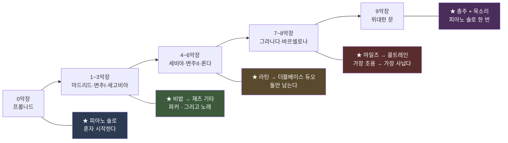

# 재즈판을 만든다 — 프롬프트와 설계

| 항목 | 내용 |
|---|---|
| 문서 성격 | **설계 + 프롬프트 전문.** 승인된 곡을 재즈로 다시 짓는 별도 실험 |
| 관련 문서 | [21 승인 기준선](<21. 음악이 끝났다 — 승인 기준선.md>) · [28 Suno 프롬프트 최종본](<28. Suno 프롬프트 최종본 — 실제로 쓴 것 전부.md>) · [29 화면 조작 매뉴얼](<29. Suno 화면 조작 매뉴얼 — 무엇을 어디에 넣나.md>) |
| **버전** | **v5.20** (2026-08-29) |
| 작성 | Claude |

### 개정 이력

| 버전 | 일자 | 변경 |
|---|---|---|
| **v5.20** | 2026-08-29 | **8절 증보 — 나온 것.** 전곡 9:59.01 · 구간별 청취 안내 · 채택 근거와 **7~8악장에서 규칙을 뒤집은 이유** · **1판과의 숫자 대조**(닮음은 그대로인데 **폭**이 넓어졌다) · 이은 방법 · 영상에 못 붙는 이유 |
| **v5.19** | 2026-08-29 | **최초 작성.** 재즈 2판 — 검수자 지적 다섯을 반영해 다섯 토막을 각각 다른 재즈로 다시 씀 |

---

> ## **★ 승인된 곡과 영상은 하나도 안 건드린다.**
> 정본은 [21](<21. 음악이 끝났다 — 승인 기준선.md>) 이 갖는다. 이 문서가 다루는 것은
> **같은 곡을 다른 사람들에게 연주시켜 본 것**이다.

---

## 1. 왜 다시 만드나 — 검수자 지적 다섯

**재즈 1판(캔자스시티 스윙, 2026-08-28)에 대한 판정이다.**

| # | 검수자 | **무엇이 원인이었나 — 전부 내 프롬프트다** |
|---|---|---|
| 1 | *"고음 저음 제한 둔 것 있으면 풀어줘."* | 음역을 대놓고 막지는 않았지만 **좁은 양식 하나를 다섯 토막에 밀어붙였고**, 제외어가 길었다 |
| 2 | *"처음부터 끝까지 빅밴드 구성으로 만들어달라고 했던 것 아니잖아. 피아노 솔로가 있어도 좋고, 보컬도 있어야 하고, 색소폰 일색인 것도 마음에 들지 않고, 재즈 기타 연주 있었나? 더블베이스 듀오가 얼마나 멋진 것인데."* | **다섯 토막에 거의 같은 문장을 넣었다.** 그리고 **제외어에 `vocals` 가 있었다** — 목소리가 나올 수가 없었다 |
| 3 | *"전체적으로 너무 잔잔함. 너무 뉴올리언즈 재즈만 만들어놓은 듯. 마일즈 데이비스나 존 콜트레인이 듣고 싶을 때가 있는거잖아. 그렇다고 찰리 파커를 무시하면 안되고."* | **★ 제외어에 `bebop` 과 `fusion` 을 넣었다.** 그리고 **「1930년대 캔자스시티」로 못박았다.** 파커도 마일즈도 콜트레인도 **전부 그 뒤 세대**다 |
| 4 | *"우리가 만들었던 원음을 너무 고집했던 것 같음. 적절한 수준에서 타협해줘."* | `Audio Influence` **86%** |
| 5 | *"샘플 만들지 말고 전체 다 만들어줘."* | — |

> **★ 셋째가 핵심이다.** 검수자가 듣고 싶어 한 소리를 **내가 제외어로 막아 놓았다.**
> **「무엇을 뺄까」를 정할 때 「무엇을 못 나오게 하는가」를 안 따졌다.**

---

## 2. 무엇을 바꿨나

| | 재즈 1판 | **재즈 2판** |
|---|---|---|
| 양식 | **다섯 토막 전부 캔자스시티 스윙** | **토막마다 다르다** (3절) |
| 목소리 | **없음** (제외어에 `vocals`) | **2 · 5 · 9악장에 있다** — 우리 가사 그대로 |
| 제외어 | 22개 (`bebop`·`fusion`·`vocals`·`orchestra`·`strings` 포함) | **12개.** 위 다섯을 **뺐다** |
| `Audio Influence` | 86% | **55%** |
| `Style Influence` | 84% | 84% (유지) |
| `Weirdness` | 13% | **26%** |
| 음역 | 언급 없음 | **`Use the full range, lowest register to screaming high`** 을 넣었다 |

---

## 3. ★ 토막마다 다른 재즈 — 그리고 왜 그 자리인가



| 토막 | 재즈 | **왜 그 자리인가 — 곡의 성질이 정한다** |
|---|---|---|
| **0악장** | **피아노 솔로 → 트리오** | 주제를 **처음 심는** 자리다. 혼자 시작해 하나씩 들어오는 것이 「제시」다 |
| **1~3악장** | **비밥 → 재즈 기타 → 코랄** | 1악장 마드리드는 **유일하게 기능화성이 또렷**하다 → 비밥이 붙는다. **2악장은 원래 나일론 기타 캐논**이다 → 재즈 기타가 제자리다 |
| **4~6악장** | **라틴 → 더블베이스 듀오** | 4악장은 **그녀의 컴파스**라 손뼉·카혼을 남긴다. **6악장 론다의 성질은 「비움」**이고, **베이스 둘만 남기는 것**이 그 비움의 재즈판이다(검수자 제안) |
| **7~8악장** | **마일즈 → 콜트레인** | 7악장은 **무그가 말 없는 목소리**다 → 하몬 뮤트 트럼펫. 8악장은 **곡에서 가장 격렬하고 유일한 연주 구간**이다 → 시트 오브 사운드 |
| **9악장** | **총주 + 목소리 + 피아노 솔로** | **두 주제가 처음 함께 울리는** 악장 |

> **★ 「토막마다 다르게」는 취향이 아니라 곡의 요구다.**
> [`07`](<07. 작곡 계획.md>) 이 악장마다 다른 성질을 부여해 뒀는데,
> **1판은 그것을 하나의 양식으로 눌러 버렸다.**

---

## 4. 프롬프트 전문 — **Styles 칸에 넣은 것 그대로**

**공통 첫 줄** — `A jazz arrangement of the uploaded track. Keep the harmony and the melody, but play it as jazz.`

**1판의 `An orchestral transcription…`(받아 적기)과 다르다.** 이번에는 **「재즈로 연주해라」**이고, 그것이 4번 지적(*"원음을 너무 고집"*)에 대한 답이다.

### 4.1 1부a — 0악장 (0:50) · 연주만

```
A jazz arrangement of the uploaded track. Keep the harmony and the melody, but
play it as jazz. This section belongs to the piano. Solo acoustic piano alone
states the theme, unaccompanied, rubato, taking its time, using the whole keyboard
from the deepest bass to the very top. Then upright double bass walks in, then
brushes on the snare. Piano trio, no horns at all here. Let the pianist improvise
around the theme, block chords, single-line runs, space. Warm live room, one take,
audible pedal and hammers and breath. Loose and human, never quantised. Full
dynamic range: real quiet, real loud.
```

### 4.2 1부b — 1~3악장 (1:50) · **2악장에 노래**

```
A jazz arrangement of the uploaded track. Keep the harmony and the melody, but
play it as jazz. Three different things in a row. First: fast bebop. Alto saxophone
burning through the line in long running eighth notes, biting, angular, Charlie
Parker energy, piano comping in stabs, bass sprinting, ride cymbal driving.
Second: the guitar takes over. Hollow-body archtop jazz guitar plays the melody as
a canon with the piano, warm and round, and a male jazz voice enters over it,
relaxed, behind the beat, close to the microphone. Third: it settles into a slow
warm ensemble chorale, horns in close harmony. Use the full range of every
instrument, lowest register to screaming high. Live room, one take, loose and human.
```

### 4.3 2부 — 4~6악장 (2:45) · **5악장에 노래**

```
A jazz arrangement of the uploaded track. Keep the harmony and the melody, but
play it as jazz. Three different things in a row. First: hot Latin jazz. Flamenco
hand claps and cajon stay, nylon guitar, piano montuno, trumpets punching, clave
underneath, loud and dancing. Then a male jazz voice sings one line over it,
relaxed, behind the beat. Then everything stops and only two double basses remain,
alone, for a long time. One walks low and steady, the other sings high with the
bow, answering it, the whole section carried by two basses and nothing else. No
drums, no horns, no piano there. Empty and enormous. Do not fill it. Use the full
range, lowest register to the very top. Live room, one take, loose and human.
```

### 4.4 3부 — 7~8악장 (3:20) · 연주만

```
A jazz arrangement of the uploaded track. Keep the harmony and the melody, but
play it as jazz. Two halves, completely different. First half: modal cool jazz.
Harmon-muted trumpet alone, spare, cool, enormous space between phrases, Miles
Davis restraint, brushes, quiet piano, walking bass, almost nothing happening and
that is the point. Second half: it explodes. Hard bop. Tenor saxophone in sheets of
sound, fast dense cascading runs, screaming into the top of the horn, Coltrane
fury. Piano hammering fourths underneath, drums with sticks riding hard, bass
relentless. This is the loudest and most violent part of the whole piece. Use the
full range, lowest register to screaming high. Live room, one take, never quantised.
```

### 4.5 4부 — 9악장 (0:55) · **네 행 노래**

```
A jazz arrangement of the uploaded track. Keep the harmony and the melody, but
play it as jazz. The finale, and everyone is here. Full band: piano, guitar, double
bass, drums, trumpets, trombones, saxophones. A male jazz voice sings the lines,
warm and unhurried, behind the beat. The piano takes a short solo over the band
before the last statement. Two melodies that have been apart all along are finally
played together. Use the full range, lowest register to the very top, and let it get
loud. Live room, one take, loose and human. Do not change the ending: one note
settles down a half step, and it comes to rest. Not triumphant, not a fanfare.
```

> **★ 마지막 두 문장은 다섯 판 중 4부에만 넣는다.**
> **F♯ 이 F 로 내려앉는 것이 이 곡의 마지막 사건**이고, 장르가 바뀌어도 그것이
> 남아야 우리 곡이다. **[T-09](<97. 회고/01. 트러블슈팅 색인.md>) 가 기각한
> 「승리의 결말」을 막는 문장**이기도 하다.

### 4.6 빼달라고 한 것 — **12개로 줄였다**

```
Hammond organ, Moog, synthesiser, rock drums, distortion, autotune, EDM,
trap drums, modern pop production, smooth jazz, elevator music, sound effects
```

**뺀 것에서 뺀 것** — `bebop` · `fusion` · `vocals` · `orchestra` · `strings` ·
`film score` · `cinematic` · `sample library` · `quantised` · `lounge` · `rap`.

> **`Hammond organ` 과 `Moog` 는 남긴다** — **원곡의 소리라 가만두면 새어 나온다.**

---

## 5. 가사 — 정본은 [`07`](<07. 작곡 계획.md>) 11장

**1판에는 목소리가 아예 없었다.** 이번에는 원래 설계대로 **프롬나드에만** 놓는다.

### 1부b (2악장)

```
[Verse]
In the cold winter light, doorways I don't know
Sunlight falls over stone, over roads I walk
I don't know anything, only that I walk

[Instrumental]

[Verse]
And behind, something walks softly after me

[Instrumental]
```

### 2부 (5악장)

```
[Instrumental]

[Verse]
Now we walk, two of us, never in one step

[Instrumental]
```

### 4부 (9악장)

```
[Verse]
I count out every step under my own feet

[Verse]
Now we walk, two of us, never in one step

[Verse]
Now the light in the old picture holds you too

[Verse]
Looking back, you were here always in my step
```

**3부(7~8악장)에는 절대 안 넣는다** — **7악장에서는 무그가 그녀의 목소리**다.

---

## 6. 설정

| | 값 | 왜 |
|---|---|---|
| 방식 | **`Cover`** | 우리 음원을 재료로 준다 |
| **`Audio Influence`** | **55%** | **86% → 55%.** 4번 지적에 대한 답 |
| `Style Influence` | **84%** | 장르를 확실히 바꾸려면 높아야 한다 |
| `Weirdness` | **26%** | 13% → 26%. *"너무 잔잔함"*에 대한 답 |
| `Vocal Gender` | **Male** | 여행자다 |
| `Duration` | 0:50 · 1:50 · 2:45 · 3:20 · 0:55 | 원본 토막 길이 |

**재료로 준 것** — Suno 에 이미 올라가 있는 우리 원본 다섯.
`mov0-planA`(0:50) · `part1b`(1:50) · `2부 (4~6악장) 2.40-5.25`(2:45) ·
`part3`(3:20) · `4부 (9악장) 8.45-9.40`(0:55).

> **★ 한글 이름으로 검색하면 안 잡히는 것이 있다.** `Uploads` 필터를 켜서 찾는다
> ([29](<29. Suno 화면 조작 매뉴얼 — 무엇을 어디에 넣나.md>)).

---

## 7. 산출물

| | |
|---|---|
| 폴더 | [`산출물/20260829 - 재즈 2판/`](<산출물/20260829 - 재즈 2판/>) |
| 곡 이름 | `jz2-1a-piano` · `jz2-1b-bebop` · `jz2-2-latin-bass` · `jz2-3-miles-trane` · `jz2-4-finale` |
| 1판 | [`산출물/20260828 - 재즈판 시험/`](<산출물/20260828 - 재즈판 시험/>) — **지우지 않는다** (R11) |

**이을 때 반드시 확인할 것** — **Suno 가 조각 끝을 사그라들게 만든다.**
그냥 이으면 이음매에 무음이 남는다. 경위와 값은 1판 README 7.1절.

---

## 8. ★ 나온 것 — 전곡 재즈 2판 (9:59.01)

**다섯 토막을 각각 두 판씩 열 개를 받아, 다섯을 골라 이었다.**

| | |
|---|---|
| 파일 | [`전곡 재즈 2판.mp3`](<산출물/20260829 - 재즈 2판/전곡 재즈 2판.mp3>) (22 MB) · `.wav` (100 MB) |
| 길이 | **599.01초 (9:59.01)** · 44.1 kHz · 최대 진폭 0.869 |

### 8.1 구간 — 무엇이 들리는가

| 시각 | 악장 | **귀에 들어오는 것** |
|---|---|---|
| **0:00** | 0 프롬나드 | **피아노 혼자다.** 주제를 천천히 짚고, 베이스가 걸어 들어오고, 브러시가 붙는다. 관악기는 하나도 없다 |
| **0:50** | 1~3 마드리드·변주 I·세고비아 | **알토 색소폰이 빠르게 내달린다**(비밥). 그다음 **재즈 기타가 피아노와 주고받고, 그 위로 목소리가 들어온다.** 끝은 관악 코랄로 가라앉는다 |
| **3:00** | 4~6 세비야·변주 II·론다 | **손뼉과 카혼이 남은 채 밴드가 스윙한다**(라틴). 노래 한 줄. 그리고 **모두 멈추고 더블베이스 둘만 남는다** — 하나는 걷고 하나는 활로 노래한다 |
| **5:43** | 7~8 그라나다·바르셀로나 | **뮤트 트럼펫 하나, 사이가 넓다**(마일즈). 그러다 **터진다** — 테너 색소폰이 쏟아붓는다(콜트레인). **곡에서 가장 조용한 데서 가장 사나운 데로** |
| **9:03** | 9 위대한 문 | **전원이 나온다.** 목소리가 네 행을 부르고 피아노가 한 번 솔로를 잡는다. **끝에서 한 음이 반음 내려앉는다** |

**듣기 시작할 자리를 하나만 고르라면 5:43 이다** — 이 판이 1판과 가장 크게 달라진 곳이다.

### 8.2 어느 판을 골랐나 — **한 번 규칙을 뒤집었다**

| 토막 | 채택 | 근거 |
|---|---|---|
| 0악장 | `jz2-1a-piano` | 닮음 0.350 > 0.327 |
| 1~3악장 | `jz2-1b-bebop` | 닮음 0.333 > 0.289 |
| 4~6악장 | `jz2-2-latin-bass (1)` | 닮음이 사실상 같아(0.243/0.246) **더 살아 있는 쪽** |
| 7~8악장 | **`jz2-3-miles-trane`** | **★ 규칙을 뒤집었다** |
| 9악장 | `jz2-4-finale (1)` | 닮음 0.431 > 0.408 · 셈여림도 낫다 |

> **★ 7~8악장에서 숫자를 버렸다.** `(1)` 이 닮음은 더 높았지만(0.387 vs 0.361)
> **168.6초로 32초가 짧았다.** 이 토막의 핵심은 **「조용한 마일즈 → 사나운 콜트레인」의 낙차**이고,
> **짧다는 것은 둘 중 하나가 잘려 나갔다는 뜻**이다.
>
> **자가 재는 것은 「닮았는가」이지 「구조가 남았는가」가 아니다.**
> 자를 만든 사람이 그 한계를 알고 있어야 한다.

### 8.3 ★ 1판과 무엇이 달라졌나 — 숫자로

| | 1판 (캔자스시티) | **2판** |
|---|---|---|
| 원곡과의 닮음 (평균) | 0.340 | **0.344** |
| 밝기 평균 | 3196 Hz | 2809 Hz |
| **밝기 폭** | 1382 | **1850** |
| 순함 평균 | 0.1783 | 0.1614 |
| **순함 폭** | 0.0890 | **0.1300** |

**읽는 법 — 평균은 거의 안 움직였고 「폭」이 넓어졌다.**

| | |
|---|---|
| **★ 닮음이 그대로다** | **`Audio Influence` 를 86% → 55% 로 31%p 내렸는데 0.340 → 0.344.** 안 움직였다. [`29`](<29. Suno 화면 조작 매뉴얼 — 무엇을 어디에 넣나.md>) 4절이 말한 **「슬라이더는 지렛대가 아니다」가 다시 확인됐다** |
| **★ 폭이 넓어진 것이 성과다** | 밝기 폭 1382 → **1850**, 순함 폭 0.089 → **0.130**. **토막마다 다른 재즈를 주문한 것이 실제로 소리에 남았다** |
| 평균이 어두워진 것 | 피아노 솔로와 마일즈 구간이 조용하고 어둡기 때문이다. **의도한 것이다** |

> **즉 이번에 효과가 있었던 것은 슬라이더가 아니라 문장이다.**
> **1판과 2판의 진짜 차이는 「제외어에서 `bebop`·`vocals` 를 뺀 것」과
> 「다섯 토막에 서로 다른 지시를 쓴 것」이었다.**

### 8.4 이은 방법

**꼬리를 먼저 재고 잘랐다.** Suno 가 조각 끝을 사그라들게 만들기 때문이다.

| 토막 | 꼬리 | |
|---|---|---|
| 1~3악장 | 0.90초 | 잘라냄 |
| 4~6악장 | 1.13초 | 잘라냄 |
| 나머지 셋 | 0.01~0.03초 | 그대로 |

그다음 **다섯 토막의 음량을 −14 LUFS 로 맞추고 0.8초씩 겹쳐 넘겼다.**
**이음매 넷 전부 정상**이고, 1판에서 났던 **−180 dB(완전 무음)** 같은 자리가 없다.

### 8.5 ★ 남은 한계 — 영상에는 못 붙는다

| | 길이 |
|---|---|
| 승인 영상 | **10:19.84** |
| 재즈 2판 | **9:59.01** |

**1~3악장이 원본보다 21초 길다**(131.6초 vs 110초) — Suno 가 비밥 솔로를 늘렸다.
**그래서 뒤 악장 시각이 전부 밀렸다.** 영상에 붙이려면 **처음부터 다시 잘라야** 한다.
**지금은 듣는 용도다.**

---

*작성 일자: 2026-08-29*
