# 뮤직비디오 제작 방법론 — 창작을 공정으로 굴리는 법

**소프트웨어 개발 방법론의 도구를 창작에 옮겨 쓴 기록입니다.**
**전문 용어는 하나도 안 미루고 그 자리에서 풉니다 (R7).**

| 항목 | 내용 |
|---|---|
| 관련 문서 | [25 프로젝트 회고](<25. 프로젝트 회고 — 스무하루 동안 무슨 일이 있었나.md>) · [01 WBS](<01. 작업 분해 구조와 백로그.md>) · [04 문서 개정 이력](<04. 문서 개정 이력.md>) · [16 도구 설명서](<16. 도구 설명서 — 무엇이 무엇을 하는가.md>) |
| **버전** | **v5.23** (2026-08-29) |
| 작성 | Claude |
| 성격 | **방법론.** 이 프로젝트에서 실제로 통한 것만 적습니다 |
| 읽는 사람 | **처음 해 보는 사람.** 소프트웨어도 음악도 몰라도 읽을 수 있게 씁니다 |

### 개정 이력

| 버전 | 일자 | 변경 |
|---|---|---|
| **v5.17** | 2026-08-25 | 최초 작성 |

---

## 목차

- [1. 이 문서는 무엇인가](#1-이-문서는-무엇인가)
- [2. 한 장으로 보는 전체 그림](#2-한-장으로-보는-전체-그림)
- [3. 왜 창작에 「공정」을 붙이나](#3-왜-창작에-공정을-붙이나)
- [4. 이 방법론의 다섯 기둥](#4-이-방법론의-다섯-기둥)
- [5. 단계 — Phase 0 부터 4 까지](#5-단계--phase-0-부터-4-까지)
- [6. 산출물 체계 — 무엇을 어디에 남기나](#6-산출물-체계--무엇을-어디에-남기나)
- [7. 게이트 — 승인을 설계하는 법](#7-게이트--승인을-설계하는-법)
- [8. ★ 자기검사 — 이 방법론의 핵심](#8--자기검사--이-방법론의-핵심)
- [9. 하루의 리듬](#9-하루의-리듬)
- [10. AI 를 쓰는 자리와 안 쓰는 자리](#10-ai-를-쓰는-자리와-안-쓰는-자리)
- [11. 돈을 다루는 법](#11-돈을-다루는-법)
- [12. 흔한 실패 열 가지](#12-흔한-실패-열-가지)
- [13. 작게 시작하는 법](#13-작게-시작하는-법)
- [14. 체크리스트](#14-체크리스트)
- [15. 용어](#15-용어)

---

## 1. 이 문서는 무엇인가

### 1.1 한 문장으로

> **뮤직비디오 한 편을 「작품」이 아니라 「프로젝트」로 다루는 방법입니다.**

「작품으로 다룬다」는 것은 **좋아질 때까지 고치는 것**입니다. 언제 끝나는지
아무도 모르고, 무엇이 좋아졌는지도 만든 사람 머릿속에만 있습니다.

「프로젝트로 다룬다」는 것은 **단계를 나누고, 각 단계의 끝에 「합격/불합격」을
정하고, 판정 근거를 밖에 남기는 것**입니다.

### 1.2 이 방법이 나온 자리

**2026년 8월 5일부터 25일까지 스무하루 동안 10분 30초짜리 뮤직비디오 한 편을
만들면서 실제로 굴린 방식**입니다. 미리 설계한 방법론이 아니라 **사고가 날
때마다 하나씩 붙인 것**이고, 그래서 **각 규칙 뒤에는 실제로 난 사고가 있습니다.**

**그 사고 목록이 [25 프로젝트 회고](<25. 프로젝트 회고 — 스무하루 동안 무슨 일이 있었나.md>) 5절**에 있습니다.

### 1.3 누가 읽으면 좋은가

| | |
|---|---|
| **혼자 긴 창작물을 만드는 사람** | 뮤직비디오 · 단편 · 앨범 · 게임 · 웹툰 — 매체는 상관없습니다 |
| **AI 도구를 섞어 쓰는 사람** | 10절이 「어디까지 맡기고 어디부터 직접 하나」를 다룹니다 |
| **의뢰인이 있는 사람** | 7절의 게이트 설계가 그 관계를 다룹니다 |

### 1.4 소프트웨어 쪽에서 무엇을 빌려 왔나

**빌려 온 것과 안 빌려 온 것을 먼저 밝힙니다.** 전부 가져오면 창작이 질식합니다.

| 소프트웨어 개념 | 빌렸나 | 무엇으로 바뀌었나 |
|---|---|---|
| **버전 관리** (git) | **○** | 문서·코드는 git, 큰 파일은 클라우드 |
| **단일 정본** (Single Source of Truth) | **◎ 핵심** | 같은 숫자를 두 곳에 안 적는다 |
| **회귀 테스트** (regression test) | **◎ 핵심** | **자기검사** — 8절 |
| **단계별 승인** (stage gate) | **○** | **게이트 G1~G7** |
| **작업 분해** (WBS) | **○** | 그대로 씁니다 |
| **일일 스탠드업** | **○** | 계획 → 세션로그 → 보고 → 회고 |
| **포스트모템** (사후 분석) | **◎ 핵심** | **사건 하나에 문서 하나** |
| 스프린트 · 스토리포인트 | ✗ | **창작은 속도를 못 예측합니다.** 억지로 재면 거짓말이 됩니다 |
| 코드 리뷰 | △ | 사람이 하나뿐이라 **도구가 대신**합니다 |

---

## 2. 한 장으로 보는 전체 그림

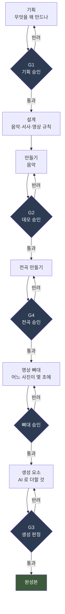

**마름모가 게이트입니다.** 통과 못 하면 앞으로 못 갑니다.

**그리고 이 그림에는 안 보이는 축이 하나 더 있습니다** — **매 단계 옆에서
계속 도는 것**입니다.

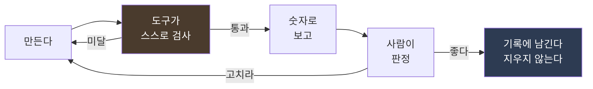

**「도구가 스스로 검사」가 이 방법론의 특징**입니다. 8절 전체가 그 이야기입니다.

---

## 3. 왜 창작에 「공정」을 붙이나

### 3.1 혼자 만들면 반드시 생기는 세 가지

**혼자 오래 만들면 누구에게나 생깁니다. 재능과 무관합니다.**

**첫째, 자기가 만든 것을 객관적으로 못 봅니다.** 백 번 들은 소리는 좋은지
나쁜지가 아니라 **익숙한지 아닌지**로 들립니다.

**둘째, 「고쳤다」와 「고쳐졌다」를 구분 못 합니다.** 이 프로젝트에서 실제로
있었던 일입니다 — **파일을 고치는 스크립트가 중간에 죽었는데 「고쳤다」고
보고했습니다.** 영상을 다시 구웠고 **어제 것과 화면이 똑같았습니다.**
20분을 버렸습니다.

**셋째, 어제 정한 것을 오늘 기억 못 합니다.** 스무하루면 판단이 수백 개
쌓입니다. **왜 그 값이 0.62 인지 반년 뒤에는 아무도 모릅니다.**

### 3.2 공정이 푸는 것

| 문제 | 공정이 하는 일 |
|---|---|
| 객관적으로 못 본다 | **숫자로 먼저 잰다.** 「좋아졌다」가 아니라 「1.185 → 0.941」 |
| 고쳤는지 모른다 | **결과물을 다시 재서 말한다.** 명령이 안 죽은 것은 증거가 아니다 |
| 기억 못 한다 | **판단을 그 자리에 적는다.** 코드 주석·개정 절·일일 기록 |

### 3.3 공정이 못 푸는 것 — **솔직하게**

**「무엇이 좋은가」는 공정이 못 정합니다.**

이 프로젝트에서 좋은 결정은 거의 전부 **사람의 한 마디**에서 나왔습니다 —
*"조잡하다"*, *"베이스가 중심임"*, *"만톤 거의 안보임"*.
**숫자는 그 뒤에 따라왔습니다.**

> **공정의 목적은 「좋은 것을 만드는 것」이 아니라
> 「좋은지 나쁜지를 판정할 수 있는 상태를 유지하는 것」입니다.**

**판정하는 사람이 따로 있으면 가장 좋고**(이 프로젝트는 그랬습니다),
없으면 **시간을 두고 자기가 판정자가 되는 장치**를 만들어야 합니다
— 며칠 묵혔다 보기, 다른 기기에서 보기, 남에게 보여주기.

---

## 4. 이 방법론의 다섯 기둥

### 기둥 ① — **정본은 하나뿐이다**

> **같은 사실이 두 곳에 있으면 반드시 어긋납니다.**

**「정본(定本)」은 「진짜 원본」이라는 뜻입니다.** 어떤 값이든
**그 값이 적힌 곳은 딱 한 군데**여야 하고, 나머지는 **그곳을 가리키기만**
합니다.

**실제로 어긋났습니다.** 이 프로젝트의 안내 문서가 실측값 표를 **사본으로**
들고 있었는데 **넷이 전부 낡아 있었습니다.** 그중 하나는
**드럼이 들어가기 전 값**이었고, 모르고 봤으면 **정상인 것을 회귀로 오해해
멀쩡한 작업을 되돌렸을 것**입니다.

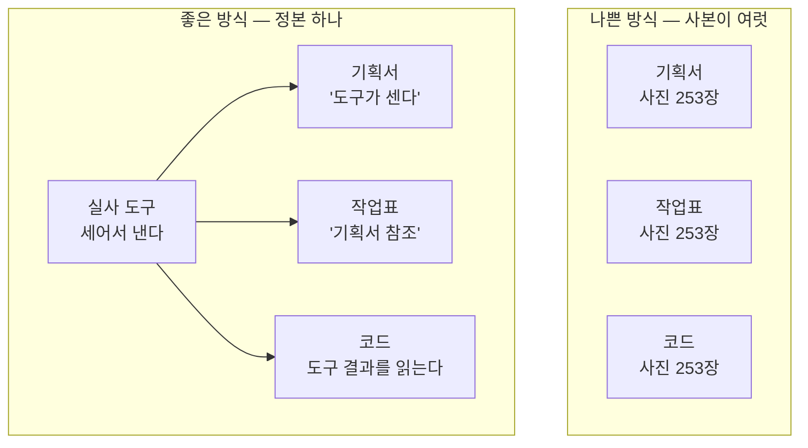

**동기화가 답이 아닙니다.** 두 곳을 맞춰 놓아도 다음에 또 어긋납니다.
**한 곳만 값을 갖는 것**이 답입니다.

### 기둥 ② — **게이트에서 멈춘다**

**「게이트(gate)」는 「관문」입니다.** 앞 단계가 승인되기 전에는 뒤 단계를
시작하지 않습니다.

**왜 멈추나** — **앞이 뒤집히면 뒤가 통째로 버려지기** 때문입니다.
이 프로젝트는 *"G3 통과 전에 사진으로 영상 만들지 않는다"*를 금지 목록에
넣어 뒀습니다. **앞당기면 버리는 일이 됩니다.**

**게이트를 설계하는 법은 7절**에 있습니다.

### 기둥 ③ — **숫자로 먼저 판정한다**

> **"좋아졌다"가 아니라 "1.185 → 0.941"로 말합니다.**

**이유가 셋입니다.**

**하나, 회귀를 잡습니다.** 「회귀(regression)」는 **고치다가 멀쩡한 것을
망가뜨리는 것**입니다. 소리는 귀로 매번 전곡을 확인할 수 없지만,
숫자는 매번 잽니다.

**둘, 시간이 지나도 비교됩니다.** 「그때보다 좋아졌나」는 기억으로 못 답하지만
숫자는 남습니다.

**셋, 남에게 설명됩니다.** 판정하는 사람이 따로 있으면 특히 그렇습니다.

**다만 함정이 있습니다** — **숫자가 설계를 대체할 수는 없습니다.**
이 프로젝트에서 **음의 비중은 정확히 쟀는데 그 음이 무엇을 뜻하는지 적힌
문장은 안 읽어서** 판단을 두 번 틀렸습니다.

### 기둥 ④ — **규칙은 도구가 집행한다**

> **문서에만 적은 규칙은 안 지켜집니다.**

**이것이 이 프로젝트가 가장 비싸게 배운 것**입니다.

| 규칙 | 문서에만 적었을 때 | **도구가 하게 했을 때** |
|---|---|---|
| 표의 숫자를 손으로 안 적는다 | 옮겨 적다 최고점을 뒤바꿔 보고 | 도구가 **코드와 결과물에서 생성** |
| 납품 형식은 32비트 무손실 | **두 번 틀렸다** | 도구가 **굽고 나서 되돌려 대조** |
| 문서가 서로 안 어긋난다 | 넷이 낡아 있었다 | **검증 도구 일곱 검사** |
| 클라우드에 다 올라갔다 | **진행률을 보고 판단** | 도구가 **대조해서 빠진 것을 찍는다** |

**8절이 이 기둥을 자세히 다룹니다.**

### 기둥 ⑤ — **기록을 지우지 않는다**

**세 층으로 지킵니다.**

| 층 | 규칙 |
|---|---|
| **문서** | 판단이 바뀌면 **원문을 남기고 「개정」 절을 덧붙인다.** 무엇이 왜 바뀌었는지 |
| **산출물** | **안 채택된 것도 안 지운다.** *"무엇과 비교해서 저것을 골랐는가"가 판정의 절반* |
| **승인물** | **승인받은 것은 내용도 이름도 안 바꾼다. 새 판은 새 파일** |

**셋째 층은 사고 뒤에 생겼습니다.** 승인받은 음원을 승인 없이 바꾸고
**원본을 지웠으며** 바뀐 파일에 「승인판」이라는 이름을 붙인 적이 있습니다.
**그 결과 기준선을 못 찍게 됐습니다.**

> **「기준선(baseline)」은 「여기서부터 잰다」는 기준점**입니다.
> 기준선이 없으면 **좋아졌는지 나빠졌는지 말할 수 없습니다.**

---

## 5. 단계 — Phase 0 부터 4 까지

**뮤직비디오는 「음악」과 「영상」 두 갈래인데, 순서를 지켜야 합니다.**

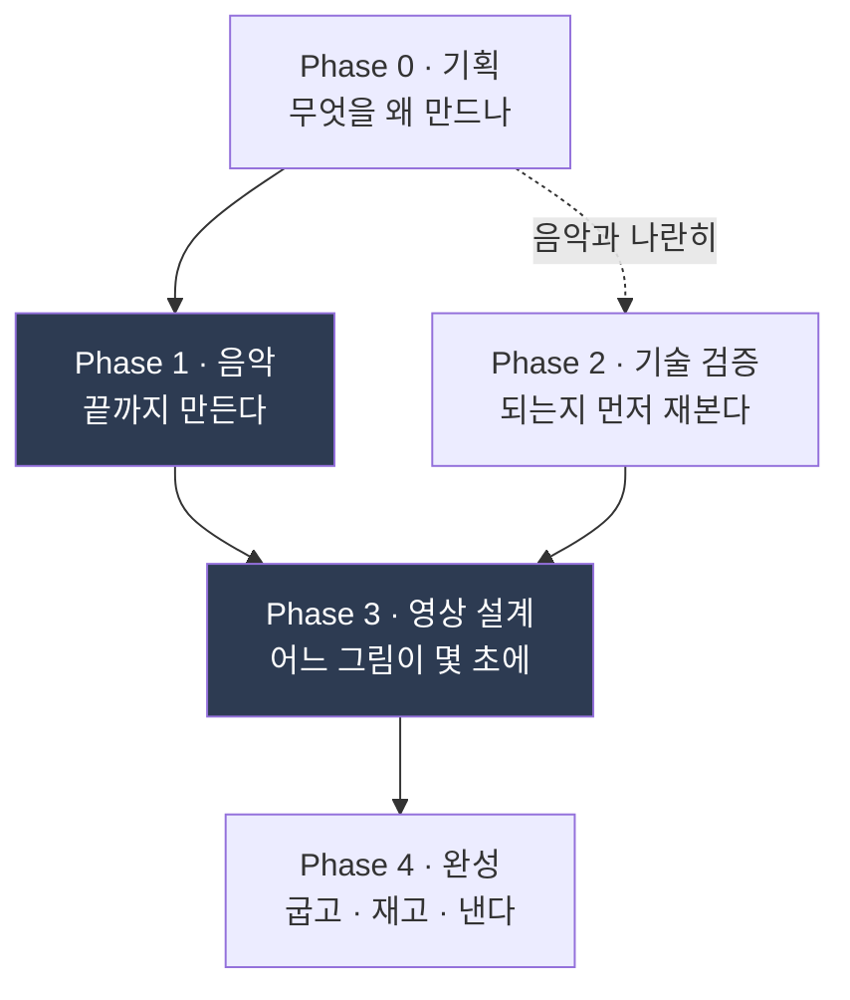

### 5.1 Phase 0 — 기획

**정하는 것 넷.**

| | |
|---|---|
| **무엇을 만드나** | 길이 · 매체 · 대상 |
| **왜 만드나** | 이것이 흔들리면 뒤가 전부 흔들립니다 |
| **절대 규칙** | **「하지 않을 것」을 먼저 정합니다** — 아래 |
| **게이트** | 몇 개를 어디에 둘 것인가 |

**★ 「절대 규칙」이 이 단계의 핵심입니다.**

이 프로젝트는 영상 규칙 넷을 처음에 못박았습니다 —
**얼굴 클로즈업 금지 · 배경 변경 금지 · 특정 악장에서 생성 금지 ·
생성은 한 인물에만.**

**금지가 왜 중요한가** — **「무엇을 할까」는 만들면서 정해도 되지만
「무엇을 안 할까」는 나중에 정하면 이미 늦습니다.** 만들어 놓고 버리게 됩니다.

**그리고 금지는 제약이 아니라 정체성이 됩니다.** 7.2절을 보십시오.

### 5.2 Phase 1 — 음악을 끝까지

> **★ 음악이 끝나기 전에 영상을 만들지 않습니다.**

**이유가 단순합니다** — **영상은 음악의 시간 위에 놓입니다.**
음악 길이가 1초만 바뀌어도 **모든 컷의 시각이 밀립니다.**

이 프로젝트는 음악이 **9분 40초에서 10분 19.84초**로 바뀌었습니다.
**영상을 먼저 만들었다면 통째로 버렸을 것**입니다.

### 5.3 Phase 2 — 기술 검증 (PoC)

**「PoC(Proof of Concept)」는 「되는지 먼저 작게 해 보는 것」**입니다.

**여기서 재야 할 것은 「예쁜가」가 아니라 「되는가」입니다.**

| 무엇을 재나 | 예 |
|---|---|
| **품질 하한** | 결과가 쓸 수 있는 수준인가 |
| **규칙 위반** | 우리가 정한 금지를 도구가 어기나 |
| **값** | 한 번에 얼마인가 · 다시 뽑으면 얼마인가 |
| **재현성** | 같은 입력에 같은 결과가 나오나 |

**★ 그리고 PoC 는 「무엇을 잴 것인가」가 바뀌면 다시 겨눠야 합니다.**

이 프로젝트의 PoC 계획은 **「풍경을 움직이는 것」**을 재게 되어 있었는데,
중간에 **「풍경은 생성하지 않는다」**로 결정이 바뀌었습니다.
**계획서를 그대로 실행했으면 우리가 하지 않을 일을 재고 있었을 것**입니다.

### 5.4 Phase 3 — 영상 설계

**두 층으로 나눕니다. 이것이 중요합니다.**

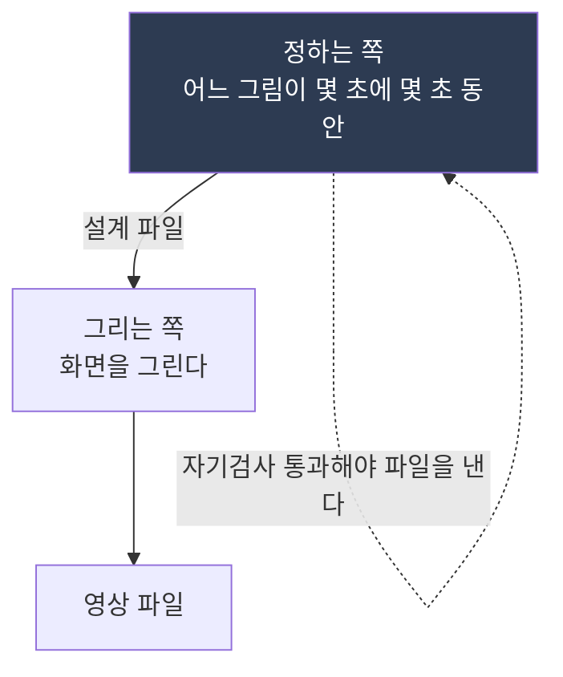

**「정하는 쪽」은 아무것도 안 그리고, 「그리는 쪽」은 아무것도 안 정합니다.**

**왜 나누나** — **배치를 바꾸려면 어디를 고쳐야 하는지가 하나로 정해집니다.**
섞어 두면 **화면을 그리는 코드 여기저기에 「이 사진은 3초」 같은 것이 흩어지고**,
바꿀 때마다 전부 찾아다녀야 합니다.

**그리고 「정하는 쪽」이 낸 파일이 곧 설계도라서, 그것만 보면
「이 영상이 무엇을 보여주는가」를 전부 알 수 있습니다.**

### 5.5 Phase 4 — 완성

**굽고 · 재고 · 낸다.** 여기서 중요한 것은 **「재고」**입니다.

**영상은 만들고 나서 반드시 다시 재야 합니다** — 소리와 그림이 맞는가,
규격이 맞는가, 프레임 수가 맞는가. **이 프로젝트에서는 도구 하나가
그 셋을 한 번에 잽니다.**

---

## 6. 산출물 체계 — 무엇을 어디에 남기나

### 6.1 세 곳으로 나눕니다

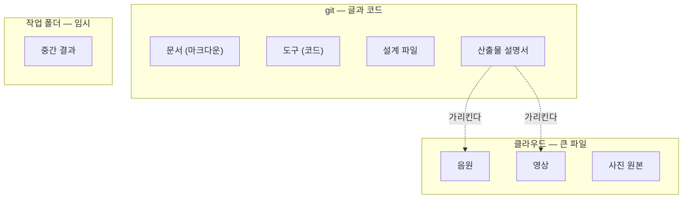

**왜 나누나** — **버전 관리 도구(git)는 한 번 넣은 파일을 영원히 기억합니다.**
영상 한 편이 400 MB 인데 열네 판을 넣으면 **5.6 GB 가 영원히 남습니다.**
게다가 대부분의 저장소는 **파일 하나에 100 MB 한도**가 있습니다.

**그래서 큰 파일은 클라우드가 갖고, 「그것이 무엇인지 적은 설명서」만 git 이
갖습니다.** 설명서가 없으면 **클라우드에 mp3 열 개가 있어도 쓸모가 없습니다.**

### 6.2 문서에 번호를 붙입니다

**`00.` `01.` `02.` … 처럼 앞에 번호를 붙이면 정렬 순서가 곧 읽는 순서**가 됩니다.

| 번호대 | 성격 |
|---|---|
| `00`~`09` | **핵심** — 기획 · 작업표 · 서사 · 이력 |
| `10`~ | **주제별** — 그때그때 필요해서 생긴 것 |
| `95`~`99` | **도구·운영·기록** — 작품이 아니라 작업에 관한 것 |

**날짜가 중요한 것은 날짜를 앞에 붙입니다** (`20260824-…`).
**이름순 정렬이 곧 시간 순서**가 되어 찾기 쉽습니다.

### 6.3 버전은 프로젝트 전체에 하나

**문서마다 따로 버전을 매기지 않습니다.**

**왜** — 문서들이 **같은 숫자를 공유**하기 때문입니다. 문서별 버전이면
「기획서 v1.2 + 작업표 v2.1」이 맞는 조합인지 **매번 따져야** 합니다.

**전체에 하나면 v1.3 은 언제나 v1.3 끼리 맞습니다.**

### 6.4 고칠 때는 순서가 있습니다

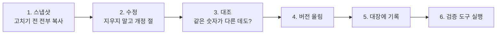

**「스냅샷」은 그 시점의 사진 같은 것**입니다. 폴더 하나에 전부 복사해 둡니다.
**되돌려야 할 때 이것이 있으면 되고 없으면 안 됩니다.**

**6번(검증 도구)이 5번까지를 실제로 했는지 확인합니다** — 사람이 빠뜨리기
때문입니다. 실제로 이 프로젝트에서 **버전 표기가 일곱 번 밀려 있던 적**이
있습니다.

---

## 7. 게이트 — 승인을 설계하는 법

### 7.1 게이트는 「합격선」이 아니라 「멈추는 자리」

**흔한 오해** — 게이트를 「품질 기준」으로만 생각합니다.
**실제로는 「여기서 멈추고 판정을 받는다」는 약속**입니다.

**게이트에 필요한 것 넷.**

| | |
|---|---|
| **무엇을 낼 것인가** | 판정할 물건이 있어야 판정합니다 |
| **무엇으로 판정하나** | 숫자든 눈이든 **미리** 정합니다 |
| **누가 판정하나** | 자기가 자기 것을 판정하면 게이트가 아닙니다 |
| **떨어지면 어디로** | 앞 단계로. **어디까지 되돌리는지**까지 |

### 7.2 ★ 게이트보다 중요한 것 — **절대 규칙**

**게이트는 「지금 이것이 좋은가」를 묻고, 절대 규칙은 「이것을 아예 하지
않는다」를 못박습니다.**

**이 프로젝트에서 절대 규칙이 한 일을 봅니다.**

| 규칙 | 겉으로는 | **실제로 한 일** |
|---|---|---|
| 얼굴 클로즈업 금지 | 제약 | **「상상 속 인물에게는 얼굴이 없다」** — 인물 설정 자체가 됐습니다 |
| 배경 변경 금지 | 제약 | **「이것은 기록이다」** — 작품의 정체성 |
| 특정 악장 생성 금지 | 제약 | **「그 장면만은 실제 기록물이어야 한다」** |
| 음집합 밖 음 금지 | 제약 | **곡 전체의 중심 아이디어** |

> **좋은 금지는 제약이 아니라 컨셉이 됩니다.**
> **그리고 금지가 있으면 「무엇을 할까」의 답이 훨씬 빨리 나옵니다.**

### 7.3 게이트를 몇 개 둘까

**너무 많으면 멈추기만 하고, 너무 적으면 크게 버립니다.**

**기준 하나** — **「여기서 뒤집히면 얼마나 버려지나」를 봅니다.**
많이 버려지는 자리 앞에 게이트를 둡니다.

이 프로젝트는 게이트를 여덟 개 뒀는데, **실제로 값을 한 것은 셋**이었습니다 —
기획 승인 · 데모 승인 · 전곡 승인. **음악이 뒤집히면 영상이 통째로
버려지기 때문**입니다.

### 7.4 판정을 받는 법 — **판정자를 막지 않는다**

**이 프로젝트가 가장 여러 번 지적받은 자리**입니다.

| 하지 말 것 | 대신 |
|---|---|
| 전문 용어를 안 풀고 쓰기 | **그 자리에서 한 줄로 풉니다.** 링크로 미루지 않습니다 |
| 숫자만 던지기 | **일상의 것에 견줍니다** — "가볍게 조깅할 때의 속도" |
| 「전체적으로 봐주세요」 | **어디를 볼지 시각으로 찍습니다** — "5:25부터 12초만" |
| 소리 문제를 글로만 설명 | **소리 문제는 소리로.** 발췌를 먼저, 견줄 것을 나란히 |
| 무엇을 정해야 하는지 안 밝히기 | **한 문장으로 끝맺습니다** — "0.5로 충분한지만 말씀해 주시면 됩니다" |

> **판정이 늦는 이유는 대개 판정자가 게을러서가 아니라
> 판정할 수 있게 안 만들어 줘서입니다.**

---

## 8. ★ 자기검사 — 이 방법론의 핵심

### 8.1 무엇인가

> **도구가 결과를 내기 전에 스스로를 검사하고, 미달이면 파일을 안 내는 것.**

**소프트웨어의 「테스트」와 비슷하지만 자리가 다릅니다.** 테스트는 보통
**따로 돌리는 것**인데, 자기검사는 **도구 안에 들어가 있어서 안 돌릴 수가
없습니다.**

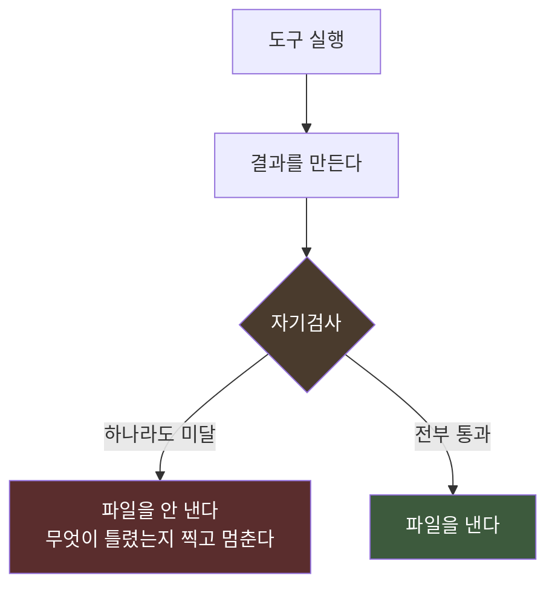

### 8.2 왜 「안 내는」 것이 중요한가

**경고만 찍고 파일을 내면 아무도 안 봅니다.**

**멈춰야 봅니다.** 이 프로젝트에서 설계 도구가 **자기검사 다섯 중 하나가
미달이라 멈췄고**, 원인을 파 보니 **서로 다른 도시에 이름이 같은 사진이
열 장** 있었습니다. 2005년 카메라의 일련번호가 한 바퀴 돈 것입니다.

**안 멈췄으면 열 장이 엉뚱한 도시 자리에 나갔을 것**이고,
**영상을 다 굽고 나서야 눈으로 발견했을 것**입니다.

### 8.3 좋은 자기검사를 만드는 법 다섯

#### ① **답을 아는 문제를 넣는다**

**재는 도구는 자기가 맞는지 스스로 모릅니다.** 그래서 **답을 아는 것을
넣어 봅니다.**

이 프로젝트의 「소리 높이를 재는 도구」가 **넉 달 동안 틀려 있었습니다** —
440 Hz 를 146 Hz 로 읽고 있었습니다. **아는 음 여덟 개를 넣어 보는 검사**를
붙이자 즉시 드러났습니다.

#### ② **끝점만 재지 않는다**

**시작·가운데·끝만 보는 검사는 도중에 무슨 일이 나든 통과합니다.**

실제로 있었습니다 — 검사 넷이 전부 통과했는데
**중간에 화면 전체가 흐려지고 있었습니다.** 아무도 중간을 안 봤습니다.

#### ③ **못 잰 것을 「통과」나 「위반」이라 말하지 않는다**

계산이 성립하지 않는 경우가 있습니다. 그때 **「위반」으로 찍으면 거짓말**이고
**「통과」로 찍으면 더 나쁜 거짓말**입니다.

**「못 쟀다」라고 말하는 갈래를 따로 둡니다.**

#### ④ **센 것을 보지 말고 무엇인지 본다**

도구가 *"버린 것 3 개"* 라고 **정직하게 찍고 있었는데**,
**그 셋이 무엇인지 아무도 안 물었습니다.** 그중 하나가 **사람의 머리**였고,
**머리 없는 인물이 네 장 나갔습니다.**

> **로그가 있어도 안 읽으면 없는 것과 같습니다.**
> **숫자를 찍을 거면 「그 숫자가 0 이 아닐 때 무엇을 뜻하는가」를 함께 정합니다.**

#### ⑤ **★ 만들었으면 일부러 틀리게 해 본다**

**가장 중요합니다.**

이 프로젝트에서 **「빠진 파일이 있는지 대조하는 검사」를 만들고 통과를 봤는데,
시험 삼아 파일을 하나 빼 보니 「빠진 것 없음」이라고 찍었습니다.**
**아무것도 안 잡는 검사**였습니다.

> **통과를 봤다는 것은 검사가 돈다는 뜻이 아닙니다.**

### 8.4 어떤 도구에 자기검사를 다나

**전부에 달면 좋지만 현실적으로는 우선순위가 있습니다.**

| 갈래 | 자기검사 |
|---|---|
| **만드는 도구** | **반드시.** 틀린 결과가 뒤로 흘러갑니다 |
| **재는 도구** | **반드시** — 다만 방식이 다릅니다(8.3 ①) |
| **★ 돈이 나가는 도구** | **가장 두껍게.** 아래 |
| 보여주는 도구 | 없어도 됩니다 |

**★ 「돈이 나가는 도구」는 이 프로젝트에서 마지막에 생긴 갈래**입니다.

| 이 도구들이 지키는 것 |
|---|
| **「진짜로 보낸다」는 표시를 안 주면 아무것도 안 보낸다** |
| **보내기 전에 값을 찍고 멈춘다** |
| **★ 받은 것을 무조건 먼저 파일로 남긴다.** 해석은 그 다음 |

**마지막 것이 사고에서 나왔습니다** — 요청은 정상으로 나갔고 돈도 나갔는데
**응답을 읽는 코드가 틀려서 결과만 못 받았습니다.** 두 번 났고
**약 $4.70 을 버렸습니다.**

---

## 9. 하루의 리듬

### 9.1 네 가지 기록

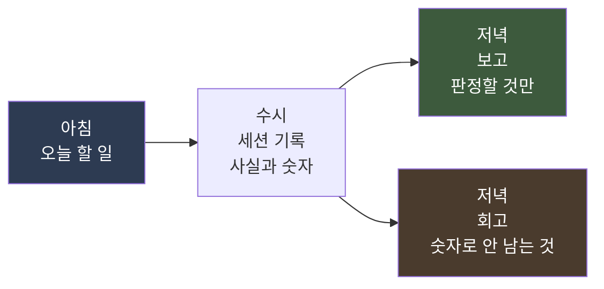

| 기록 | 주기 | 무엇 |
|---|---|---|
| **계획** | 아침 1회 | 오늘 할 일과 **왜 오늘인지**. **하지 않을 것까지** |
| **세션 기록** | 수시 | **사실과 숫자만.** 나머지 둘의 원본 |
| **보고** | 저녁 1회 | **판정자가 읽고 판단할 것만** 추림 |
| **회고** | 저녁 1회 | 판단이 어떻게 굴러갔는지 · **실수의 모양** |

### 9.2 규칙 셋

**① 계획은 틀려도 안 고칩니다.**
저녁에 결과에 맞춰 손보면 **그 순간 회고 재료가 사라집니다.**
어긋난 자리는 보고와 회고가 다룹니다.

**② 세션 기록은 갱신하지 않고 새로 만듭니다.**
**그 시점의 앎을 보존해야** 합니다. 오후에 뒤집힌 오전의 판단이 지워지면
**다음에 같은 함정을 못 봅니다.**

**③ 하루를 닫는 것은 판정자가 말했을 때만 합니다.**
이 프로젝트는 계획서에 적어 두고 **스스로 발동**해서, **하루가 다섯 시간 더
남았는데 오전만 담은 보고가 남은 적**이 있습니다.

### 9.3 ★ 회고에서 「모양끼리 묶기」

**회고를 「오늘 뭘 잘못했나」의 나열로 쓰면 다음 날 안 봅니다.**

> **실수를 모양끼리 묶습니다. 열 번 틀렸는데 모양이 넷이면 고칠 것은 넷입니다.**

이 프로젝트의 실수 열둘이 **넷으로 줄었습니다** —
① 아는 것을 안 쓰고 짐작함 ② 명령이 안 죽은 것을 결과로 읽음
③ 검사가 무름 ④ 승인된 설계를 안 읽음.

**그리고 모양이 반복되면 그때 규칙이나 도구를 만듭니다.**

### 9.4 사건 하나에 문서 하나

**큰 사고는 하루 기록이 아니라 따로 문서를 만듭니다.**

**반드시 들어가야 하는 절이 있습니다.**

> **「어제는 왜 못 봤나」**

**원인은 한 번 고치면 끝이지만 「인지 실패의 구조」는 남습니다.**
*"부주의했다"*로 끝내면 다음에 또 납니다.

---

## 10. AI 를 쓰는 자리와 안 쓰는 자리

### 10.1 세 종류를 구분합니다

**「AI 를 쓴다」는 말이 너무 넓어서 판단이 안 됩니다. 셋으로 나눕니다.**

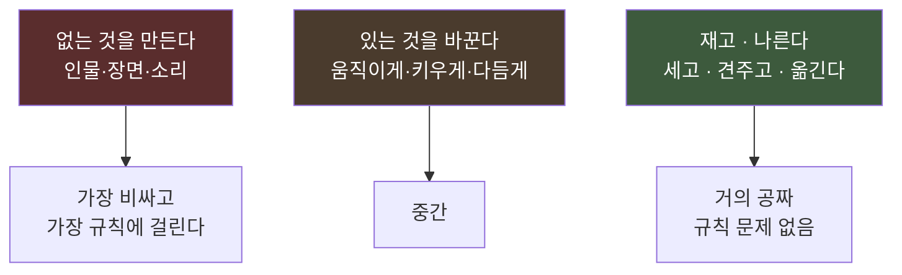

**이 프로젝트의 실제 판단이 이 표를 따라갔습니다.**

| 무엇 | 어느 종류 | 어떻게 했나 |
|---|---|---|
| 사진에 **없던 인물** | ① 없는 것을 만든다 | **AI 로 그렸습니다.** 대신 **여섯 곳뿐**이고 규칙 넷이 걸립니다 |
| 사진에 **있던 고양이**를 움직이게 | ② 있는 것을 바꾼다 | **AI 로 움직였습니다.** 규칙에 안 걸립니다 |
| 도시 풍경 | — | **안 만듭니다.** 코드가 사진을 천천히 움직입니다 |

### 10.2 ★ 「할 수 있다」와 「해야 한다」는 다릅니다

**이 프로젝트가 하루 만에 배운 것**입니다.

인물을 **영상으로** 만들려고 네 편을 뽑았는데, 재 보니
**첫 프레임과 마지막 프레임이 거의 같았습니다.** 거의 안 움직이는 데
**한 편에 $2.35** 를 냈습니다.

**그런데 더 큰 것을 알았습니다.**

> **사진 244장 속 사람들은 전부 정지해 있습니다.
> 그 인물만 움직이면 오히려 튑니다.**

**「AI 영상 생성」이라는 말에 끌려 「움직여야 한다」고 혼자 정했던 것**이고,
규칙 문서 어디에도 그런 말은 없었습니다.

**영상 생성 대신 이미지 편집으로 바꾸자 값이 39분의 1이 됐습니다.**

### 10.3 다시 뽑을 수 있는가

> **「한 번에 끝내야 하는 도구」로는 마음에 드는 것을 못 만듭니다.**

| | 영상 생성 | 이미지 편집 |
|---|---|---|
| 한 장에 | $3.13 | **$0.08** |
| 여섯 자리를 다섯 번씩 다시 | $94 | **$2.40** |

**$2.40 은 영상 한 편 값과 같습니다.** 도구를 고를 때
**「한 번의 값」이 아니라 「다시 뽑는 값」**을 봅니다.

### 10.4 AI 에게 시킬 때의 규칙 넷

| # | |
|---|---|
| **1** | **할 일을 먼저, 금지를 뒤에.** 금지를 앞에 몰면 **아무것도 안 합니다** |
| **2** | **금지는 반드시 적습니다.** 시키지 않은 것을 합니다 |
| **3** | **범위를 좁혀서 줍니다.** 전체를 주면 **구도를 다시 잡습니다** |
| **4** | **결과를 계산으로 확인합니다.** 「거의 같다」는 「그대로다」가 아닙니다 |

**3번의 실제 예** — 사진 전체를 주니 모델이 **왼쪽 30%·작게 놓은 인물을
한가운데·네 배 크기로** 다시 그렸습니다. **인물이 설 칸만 잘라 보내니**
옮길 데가 없어졌습니다.

**4번의 실제 예** — 배경이 「구조적으로 거의 같다」는 값은 0.9925 로 훌륭했는데,
**화소 단위로 보니 전체가 조금씩 다르고 화면의 36%가 달라져 있었습니다.**
**모델이 사진 전체를 다시 그린 것**입니다.

> **그래서 결과에서 필요한 부분만 오려 손 안 댄 원본에 되붙입니다.**
> **그러면 「배경은 원본 그대로」가 계산으로 증명됩니다.**

---

## 11. 돈을 다루는 법

### 11.1 상한을 먼저 정합니다

**「얼마까지 쓸 것인가」를 만들기 전에 정합니다.** 이 프로젝트는
검증에 $20, 본편에 $40 로 두고 **문서 여러 곳이 그 숫자를 공유**했습니다.

### 11.2 값은 반드시 실측합니다

**공개된 가격표와 실제 청구가 다릅니다.** 이 프로젝트는
**문서에 적어 둔 값이 실제의 절반**이었습니다.

**한 번 돌려 보고 그 값으로 문서를 고칩니다.**

### 11.3 쪼개서 씁니다

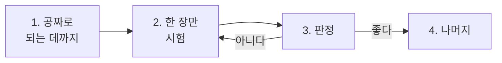

**「여섯 장을 한꺼번에 뽑았다가 전부 못 쓰면 돈과 시간을 같이 버립니다.」**

### 11.4 ★ 가장 비싼 실수는 「받은 것을 못 읽는 것」

이 프로젝트가 태운 돈의 **27%가 이것**이었습니다.
**요청은 정상으로 나갔고 만들어졌고 청구도 됐는데, 받는 코드가 틀려서
결과만 못 가져왔습니다.**

> **보낸 뒤에 받은 것을 무조건 먼저 파일로 떨어뜨립니다. 해석은 그 다음입니다.**

### 11.5 자동 충전은 끕니다

**실수로 많이 돌려도 정해 둔 금액에서 멈춥니다.**

---

## 12. 흔한 실패 열 가지

**전부 이 프로젝트에서 실제로 난 것입니다.**

| # | 실패 | 왜 나나 | 막는 법 |
|---|---|---|---|
| **1** | **고쳤다고 했는데 안 고쳐졌다** | 명령이 실패 안 한 것을 결과로 읽음 | **결과물을 다시 재서 말한다** |
| **2** | **같은 숫자가 두 곳에서 어긋난다** | 사본을 만들어 둠 | **정본 하나 · 나머지는 가리키기만** |
| **3** | **검사가 아무것도 안 잡는다** | 만들고 통과만 봄 | **일부러 틀리게 해 본다** |
| **4** | **승인된 설계를 스스로 뒤집는다** | 숫자만 보고 문장을 안 읽음 | **설계 문서를 옆에 놓고 대조** |
| **5** | **아는 것을 안 쓰고 짐작한다** | 추정기를 먼저 만듦 | **「이 값을 어디서 아는가」를 먼저 묻는다** |
| **6** | **되물어서 시간을 버린다** | 이미 받은 지시를 재확인 | **새로 생긴 갈림길만 묻는다** |
| **7** | **큰 작업을 확인 없이 돌린다** | 될 거라고 가정 | **작게 먼저** (300프레임 · 한 장) |
| **8** | **문제를 좁게 본다** | 「지금 열어 둔 파일」 안에서만 품 | **「어디서 할까」를 먼저 묻는다** |
| **9** | **승인물을 바꾸고 원본을 지운다** | 좋아질 거라고 생각 | **새 판은 새 파일 · 해시를 문서에 박는다** |
| **10** | **진행률을 완료로 읽는다** | 로그를 결과로 착각 | **완료는 대조로만 말한다** |

**8번의 예가 특히 비쌌습니다** — 「화면을 선명하게 하는 일」을 **화면 그리는
코드 안에서** 풀었더니 **매 프레임마다 걸려 렌더가 22분에서 76분**이 됐습니다.
**영상 인코딩 단계에서 하면 한 번에 끝나는 일**이었고, **그 방식이 이미
다른 문서에 적혀 있었습니다.**

---

## 13. 작게 시작하는 법

**여기까지 읽고 「너무 많다」고 느끼는 것이 정상입니다.**
**이 프로젝트도 처음부터 이렇지 않았습니다.**

### 13.1 최소 구성 — 이것만은

| # | 무엇 | 왜 |
|---|---|---|
| **1** | **문서 두 개** — 「무엇을 왜」 · 「할 일 목록」 | 나머지는 나중에 생깁니다 |
| **2** | **절대 규칙 세 줄** | **하지 않을 것부터** |
| **3** | **버전 관리** (git) + 스냅샷 폴더 | 되돌릴 수 있어야 과감해집니다 |
| **4** | **게이트 한 개** — 가장 크게 버려질 자리 앞 | |
| **5** | **하루 한 줄 기록** | 계획·회고는 나중에 |

### 13.2 언제 무엇을 더하나

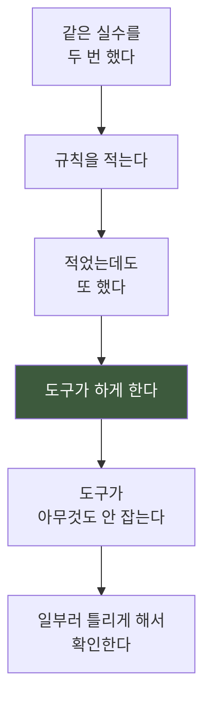

> **규칙을 미리 다 만들지 않습니다. 사고가 나면 그때 만듭니다.**
> **다만 「같은 모양이 두 번째」면 반드시 만듭니다.**

### 13.3 도구는 「손으로 두 번 한 일」부터

**세 번째 하기 전에 도구로 만듭니다.** 그 전에는 손으로 하는 게 빠릅니다.

**그리고 도구를 만들 때 「자기검사」를 같이 만듭니다.** 나중에 붙이려면
안 붙입니다.

---

## 14. 체크리스트

### 14.1 프로젝트를 시작할 때

- [ ] **무엇을 왜 만드는지** 한 문단으로 적었다
- [ ] **절대 규칙**(하지 않을 것)을 적었다
- [ ] **게이트**를 어디에 둘지 정했다
- [ ] **판정하는 사람**이 누구인지 정했다
- [ ] **버전 관리**를 켰다
- [ ] **비용 상한**을 정했다

### 14.2 문서를 고칠 때

- [ ] 고치기 전 **스냅샷**을 남겼다
- [ ] 기존 내용을 **안 지우고** 개정 절을 덧붙였다
- [ ] 바뀐 숫자가 **다른 문서에도** 있는지 봤다
- [ ] 버전을 올리고 **대장에 기록**했다
- [ ] **검증 도구**를 돌렸다

### 14.3 도구를 만들 때

- [ ] **자기검사**를 같이 만들었다
- [ ] 미달이면 **파일을 안 낸다**
- [ ] **일부러 틀리게 해서** 잡히는지 확인했다
- [ ] 답을 아는 것을 넣어 봤다 (재는 도구)
- [ ] **돈이 나가면** — 「진짜」 표시 없이는 안 보낸다 · 값을 찍고 멈춘다 · 받은 것을 먼저 남긴다

### 14.4 결과물을 낼 때

- [ ] **다시 재서** 말했다 (명령이 안 죽은 것 말고)
- [ ] **승인물이면** 이름·내용을 안 바꿨다
- [ ] **해시**를 문서에 박았다
- [ ] **안 채택된 것도** 안 지웠다
- [ ] 판정자가 **어디를 볼지** 시각으로 찍어 줬다
- [ ] **무엇을 정해야 하는지** 한 문장으로 끝맺었다

---

## 15. 용어

| 말 | 뜻 |
|---|---|
| **정본** | 어떤 값이 적힌 **진짜 한 곳.** 나머지는 이것을 가리키기만 한다 |
| **게이트** | **멈추고 판정을 받는 자리.** 통과 못 하면 뒤로 못 간다 |
| **기준선** | **「여기서부터 잰다」는 기준점.** 없으면 좋아졌는지 말할 수 없다 |
| **회귀** | 고치다가 **멀쩡한 것을 망가뜨리는 것** |
| **자기검사** | 도구가 **결과를 내기 전에 스스로 확인**하고 미달이면 안 내는 것 |
| **스냅샷** | 그 시점의 **전체 복사본.** 되돌릴 때 쓴다 |
| **PoC** | **되는지 먼저 작게 해 보는 것** (Proof of Concept) |
| **WBS** | 할 일을 **나무처럼 쪼갠 표** (Work Breakdown Structure) |
| **렌더** | 설계를 **실제 파일로 굽는 것** |
| **재현성** | 같은 입력에 **같은 결과**가 나오는 성질 |
| **포스트모템** | 사고가 난 뒤 **왜 났고 왜 못 봤는지** 적는 것 |

---

## 마지막으로 — 이 방법론의 한 문장

**스무하루를 통틀어 가장 여러 번 반복된 문장이 이것입니다.**

> ## **「거의 같다」는 「그대로다」가 아니다.**

배경이 99.25% 같다는 값을 통과로 보고할 뻔했고,
전송 진행률 95%를 완료로 읽었고,
어제와 똑같은 영상을 다르다고 말했고,
넉 달 동안 재현되지 않는 결과를 재현된다고 믿었습니다.

**전부 같은 문장의 다른 얼굴입니다.**

**그리고 이 방법론의 모든 장치는 결국 그 문장 하나를 막기 위한 것입니다** —
정본을 하나로 두는 것도, 숫자로 먼저 재는 것도, 도구가 스스로 검사하는 것도,
기록을 안 지우는 것도.

**「거의」와 「그대로」 사이를 사람이 매번 눈으로 가릴 수 없기 때문입니다.**

---

*작성 일자: 2026-08-25 · v5.17*
