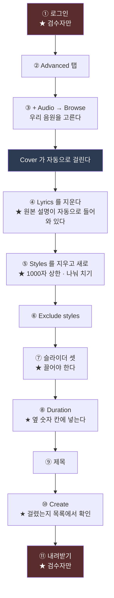

# Suno 화면 조작 매뉴얼 — 무엇을 어디에 넣나

| 항목 | 내용 |
|---|---|
| 문서 성격 | **조작 매뉴얼.** 화면의 어느 칸에 무엇을 넣고, 무엇이 안 되는가 |
| 관련 문서 | [17 설계](<17. Suno 로 음원 만들기 — 설계.md>) · [19 한계](<19. 조각을 전곡으로 잇는다 — Suno 의 역할과 한계.md>) · [27 가이드](<27. 뮤직비디오 제작 가이드 — 처음부터 끝까지 따라 하기.md>) 10.2절 · [28 프롬프트](<28. Suno 프롬프트 최종본 — 실제로 쓴 것 전부.md>) |
| **버전** | **v5.24** (2026-08-29) |
| 작성 | Claude |
| 읽는 사람 | **Suno 화면을 직접 다루는 사람.** 사람도, 브라우저를 모는 Claude 도 |

### 개정 이력

| 버전 | 일자 | 변경 |
|---|---|---|
| **v5.18** | 2026-08-28 | **최초 작성.** 재즈판을 만들면서 부딪힌 함정 일곱을 그 자리에서 적었다 |

---

## 0. 왜 이 문서가 따로 있나

**Suno 문서가 이미 셋 있는데 넷째를 만든 이유가 있다.**

| 문서 | 무엇을 말하나 | **무엇을 말하지 않나** |
|---|---|---|
| [17](<17. Suno 로 음원 만들기 — 설계.md>) | **설계** — 어떤 값으로 무엇을 만들 것인가 | 그 값을 **화면 어디에** 넣는지 |
| [19](<19. 조각을 전곡으로 잇는다 — Suno 의 역할과 한계.md>) | **한계** — `KEEP`·`Duration`·크로스페이드 | 화면 조작 |
| [27](<27. 뮤직비디오 제작 가이드 — 처음부터 끝까지 따라 하기.md>) 10.2 | **개념** — 왜 조각으로 오나, 무엇을 확인하나 | 화면 조작 |
| **이 문서** | **조작** — 어느 칸, 어떤 순서, 무엇이 안 되나 | 설계값 (17 이 정본) |

> **2026-08-28 에 이것이 드러났다.** 재즈판을 만들려고 화면을 몰다가
> **문서 셋 어디에도 없는 함정 일곱에 연달아 걸렸다.**
> 검수자 — *"suno 매뉴얼 다시 만들어야겠네. 설마 이전에 만들어둔 것 읽어보지도 않은거야?"*
>
> **읽지 않은 것도 사실이고, 읽었어도 없었던 것도 사실이다.** 둘 다 적는다.

**숫자는 여기 두지 않는다.** 설계값은 [17](<17. Suno 로 음원 만들기 — 설계.md>) 6절이 정본이다.

---

## 1. 전체 흐름



**붉은 두 칸은 Claude 가 못 한다.** 로그인은 비밀번호를 못 치기 때문이고,
내려받기는 **브라우저가 파일을 저장하는 동작을 도구가 못 하기** 때문이다.

---

## 2. 단계별

### 2.1 ① 로그인 — 검수자가 한다

**Claude 는 비밀번호를 치지 않는다.** 로그인된 크롬이 이미 있어야 한다.

> **앱 안의 브라우저를 쓰지 않는다** (검수자 지시, 2026-08-28) —
> *"앱 안의 브라우저 하지 마라. 계속 Claude APP이 죽는다."*
> **크롬 확장(`claude-in-chrome`)으로만** 붙는다.

### 2.2 ② `Advanced` 탭

`Simple` 은 칸이 모자란다. **`Advanced` 에만 `Audio Influence` 와 `Exclude styles` 가 있다.**

### 2.3 ③ 우리 음원을 재료로 걸기

`+ Audio` → **`Browse`** → 검색창에 이름 일부 → **`Remix`**

| | |
|---|---|
| **`Browse`** | **이미 올려 둔 것 중에서 고른다.** 다시 안 올려도 된다 |
| `Upload` | 새 파일. **[19](<19. 조각을 전곡으로 잇는다 — Suno 의 역할과 한계.md>) 가 적어 둔 크기 한계**에 걸릴 수 있다 |

**고르면 `Cover` 가 자동으로 걸린다.** 이것이 「우리 곡을 재료로 준다」는 뜻이다.

> **★ 우리 원본과 그 원본의 커버가 목록에 섞여 있다.** `Upload` 라고 표시된 것이
> 우리가 올린 원본이다. **커버를 또 커버하면 원본에서 두 다리 멀어진다.**

### 2.4 ④ 가사 칸 — **자동으로 채워진 것을 지운다**

**`Remix` 로 고르는 순간 Suno 가 원본을 자기 말로 해석해 가사 칸에 넣는다.**
2026-08-28 에 우리 9악장에 대해 이렇게 들어와 있었다 —

```
[Intro]
[staccato square wave synth arpeggio]
[electronic kick drum enters]
[Section A]
[distorted synth bass enters]
[gated snare on beats 2 and 4]
```

**우리 곡에 없는 것들이다.** 그대로 두면 그 지시대로 만든다.

> **가장 안전한 길 — `More Options` 의 `Lyrics` 를 `Instrumental` 로 누른다.**
> 손으로 `[Instrumental]` 을 치는 것보다 확실하다.

### 2.5 ⑤ Styles — **함정이 둘 있다**

**`Styles` 칸도 원본 설명으로 자동으로 채워져 있다.** 지우고 새로 넣는다.

| # | 함정 | 무슨 일이 나나 |
|---|---|---|
| **1** | **1000자 상한** | **넘으면 조용히 잘린다.** 경고가 없고 **끝 문장이 사라진다.** 2026-08-28 에 1033자를 넣어 **종결 지시가 통째로 날아갔다** |
| **2** | **한 번에 길게 치면 페이지가 굳는다** | 156자를 한 번에 쳤더니 **30초 넘게 멈췄다.** **약 90자씩 나눠 치면 안 굳는다** |

> **★ 2번의 함정 안에 또 하나가 있다** — 도구가 「시간 초과」를 내도
> **글자는 들어가 있다.** 놀라서 다시 치면 **두 번 들어간다.**
> **반드시 화면을 보고 확인한 뒤에 다음을 친다.**

**칸 오른쪽 아래에 `963/1000` 처럼 글자 수가 뜬다. 붉게 `1000/1000` 이면 잘린 것이다.**

### 2.6 ⑥ Exclude styles — 빼달라고 할 것

**「무엇을 넣어라」보다 「무엇을 빼라」가 잘 먹는다.**
우리 프로젝트가 매번 빼는 것은 **해먼드·무그·신디사이저** 셋이다 —
**원곡에 있는 소리라 가만두면 새어 나온다.**

### 2.7 ⑦ 슬라이더 셋 — **끌어야 한다**

`Weirdness` · `Style Influence` · `Audio Influence`

| # | 함정 | |
|---|---|---|
| **3** | **접근성 트리에는 `range` 로 보이는데 실제로는 `DIV`** | **값을 직접 넣는 도구가 「DIV 는 지원 안 함」으로 거절한다.** 끌어야만 한다 |
| **4** | **끌어도 안 먹을 때가 있다** | 2026-08-28 에 `Duration` 을 끌었는데 **3:00 그대로였다.** 확인 안 했으면 그 값으로 돌릴 뻔했다 |

**끌 자리 잡는 법** — 눈금 왼쪽 끝이 0%, 오른쪽 끝이 100%다.
**끈 뒤에는 반드시 숫자를 눈으로 읽는다.** 14% · 81% · 86% 처럼 목표에서
1~2%p 어긋나는데, **그 정도는 결과를 안 가른다**(4절 참조).

### 2.8 ⑧ Duration — **★ 옆 숫자 칸에 넣는다**

**이것이 4번 함정의 우회로다.** 슬라이더는 DIV 라 못 넣지만
**바로 옆 `0:55` 라고 뜨는 자리는 진짜 입력칸이라 값을 그대로 넣을 수 있다.**

> **다만 [19](<19. 조각을 전곡으로 잇는다 — Suno 의 역할과 한계.md>) 가 적어 둔 대로
> `Duration` 은 지켜지지 않는다.** 2026-08-28 에 0:55 를 준 여섯 판 중 **하나가 2:03** 으로 나왔다.
> **넣는 것과 지켜지는 것은 다른 문제다.**

### 2.9 ⑨ 제목 — 나중에 못 찾는다

**제목을 안 주면 원본 파일명이 그대로 붙어 판을 구분할 수 없다.**
**무엇이 다른 판인지가 이름에 들어가야 한다** — 예: `mov9-jazz-KC-86`
(9악장 · 재즈 · 캔자스시티 · Audio 86%).

### 2.10 ⑩ Create — **걸렸는지 확인한다**

| # | 함정 | |
|---|---|---|
| **5** | **눌러도 안 걸릴 때가 있다** | 2026-08-28 에 한 번 그냥 안 걸렸다. **목록에 카드 둘이 뜨는지 보고**, 안 뜨면 다시 누른다 |

**한 번에 두 판이 나온다.** 같은 설정인데 서로 다르다 — **그 차이가 설정 차이보다 클 수 있다**(4절).

### 2.11 ⑪ 내려받기 — 검수자가 한다

**브라우저가 파일을 저장하는 동작을 도구가 못 한다.**
검수자가 `···` → `Download` → `WAV` 로 받아 주셔야 한다.

---

## 3. ★ 창 크기 — 여섯째 함정

| # | 함정 | |
|---|---|---|
| **6** | **창을 줄이면 좌표가 전부 어긋난다** | 2026-08-28 에 창이 1568×698 에서 **422×258** 로 바뀌었다. **그때까지 쓰던 좌표가 전부 딴 데를 가리켰다** |

**대응 — 좌표 대신 요소를 집는다.** 화면에서 이름으로 찾아 그 요소를 직접 누르면
**창 크기와 무관**하다. **창이 작아 화면이 안 보일 때도 동작한다.**

---

## 4. ★ 일곱째 — 설정을 믿지 말 것

| # | | |
|---|---|---|
| **7** | **같은 설정으로 두 번 뽑은 것끼리의 차이가 설정을 크게 바꿨을 때의 차이보다 클 수 있다** | 2026-08-28 실측 |

`Audio Influence` 를 70·85·95 로 쓸어 봤더니 —

| | 원곡과의 닮음 평균 | **같은 값 안에서의 차이** |
|---|---|---|
| 70% | 0.590 | **0.123** |
| 85% | 0.633 | **0.145** |
| 95% | 0.557 | **0.147** |

**값을 25%p 움직인 차이(0.076)보다 같은 값 안에서의 차이가 크다.**

> **그러니 「값을 조금씩 바꿔 가며 최적을 찾는」 방식은 여기서 성립하지 않는다.**
> **바꿀 것은 슬라이더가 아니라 문장이다.**

재는 도구는 [`오케스트라대조.py`](<99. 작업 스크립트/오케스트라대조.py>), 기록은
[`산출물/20260828 - 오케스트라판 시험/README.md`](<산출물/20260828 - 오케스트라판 시험/README.md>).

---

## 5. 함정 일곱 — 한눈에

| # | 어디서 | 무엇 | 어떻게 피하나 |
|---|---|---|---|
| 1 | Styles | **1000자 상한, 경고 없이 잘림** | 글자 수를 보고 **950자 안에서** 쓴다 |
| 2 | Styles | **길게 치면 페이지가 굳음** | **90자씩** 나눠 치고 **화면을 보고** 다음을 친다 |
| 3 | 슬라이더 | **DIV 라 값 입력 불가** | 끈다 |
| 4 | 슬라이더 | **끌어도 안 먹을 때가 있음** | **끈 뒤 숫자를 읽는다.** Duration 은 **옆 숫자 칸** |
| 5 | Create | **눌러도 안 걸릴 때가 있음** | **목록에 카드 둘**이 뜨는지 본다 |
| 6 | 창 | **크기가 바뀌면 좌표가 어긋남** | **요소를 이름으로 집는다** |
| 7 | 전체 | **같은 설정이 같은 결과를 안 냄** | **설정을 쓸지 말고 문장을 고친다** |

**[19](<19. 조각을 전곡으로 잇는다 — Suno 의 역할과 한계.md>) 와 [28](<28. Suno 프롬프트 최종본 — 실제로 쓴 것 전부.md>) 7절의 함정 다섯은 여전히 유효하다** —
`KEEP` 이 KEEP 이 아니다 · `Duration` 이 `Extend` 에서 안 먹는다 ·
크로스페이드가 길이를 먹는다 · 분리에 「현악」 칸이 없다 · 론다가 설계와 반대로 커졌다.
**합치면 열둘이다.**

---

## 6. 화면 그림

**아직 안 붙였다.** 브라우저 도구가 찍은 화면을 **파일로 내보내는 길이 없어서**다
(`save_to_disk` 를 줘도 경로를 안 알려주고 디스크에서 못 찾았다).

**붙일 자리와 이름을 미리 정해 둔다** — `자료/Suno 화면/` 아래.

| 자리 | 파일명 | 무엇을 담나 |
|---|---|---|
| 2.3 | `03-Browse 로 우리 음원 고르기.png` | `Choose a song to Remix` · `Upload` 표시 |
| 2.4 | `04-자동으로 채워진 가사.png` | `[staccato square wave synth arpeggio]` 가 보이는 화면 |
| 2.5 | `05-Styles 1000자 경고.png` | 붉은 `1000/1000` |
| 2.7 | `07-슬라이더 셋.png` | 14% · 81% · 86% |
| 2.8 | `08-Duration 숫자 칸.png` | `0:55` |
| 2.10 | `10-카드 둘이 떴다.png` | 생성 중인 두 판 |

> **★ `.gitignore` 주의.** `*.jpg` 는 전부 막혀 있고 **`산출물/**/*.png` 도 막혀 있다.
> **PNG 로, `자료/` 아래**에 두어야 GitHub 에서 보인다.
> 문서에서 가리킬 때 **경로의 공백은 `%20`** 으로 쓴다.

---

*작성 일자: 2026-08-28*
