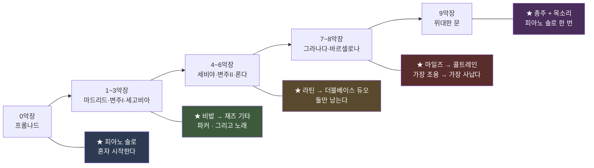

# 재즈판을 만든다 — 프롬프트와 설계

| 항목 | 내용 |
|---|---|
| 문서 성격 | **설계 + 프롬프트 전문.** 승인된 곡을 재즈로 다시 짓는 별도 실험 |
| 관련 문서 | [21 승인 기준선](<21. 음악이 끝났다 — 승인 기준선.md>) · [28 Suno 프롬프트 최종본](<28. Suno 프롬프트 최종본 — 실제로 쓴 것 전부.md>) · [29 화면 조작 매뉴얼](<29. Suno 화면 조작 매뉴얼 — 무엇을 어디에 넣나.md>) |
| **버전** | **v5.25** (2026-08-29) |
| 작성 | Claude |

### 개정 이력

| 버전 | 일자 | 변경 |
|---|---|---|
| **v5.23** | 2026-08-29 | **11절 신설 — `Extend` 화면을 어떻게 쓰나.** **어느 매뉴얼에도 없던 절차 셋**: `Select All` 로 전체를 `KEEP` 으로 만든다 · **`Get Full Song` 은 Create 목록에 마우스를 올려야만 나온다** · 다운로드는 창을 한 번 더 눌러야 한다. **★ `KEEP` 이 얼마나 KEEP 인지 처음으로 쟀다 — 상관 0.998742, 표본 대 표본 최대 0.35.** 그리고 **커버가 둘이라 엉뚱한 판을 이어 붙였다**(`Extend from` 시각으로 가린다) |
| **v5.22** | 2026-08-29 | **10절 증보 — 끝을 맺는다.** 잘린 두 토막을 고치는 **세 방법**(Suno `Extend` · 잔향 꼬리 · 원본+Suno 끝 이어붙이기)과 **★ 악장 경계 다섯을 짐작으로 찍은 실패** |
| **v5.21** | 2026-08-29 | **9절 증보 — 이어 붙이는 법.** **`loudnorm` 을 버렸다**(순간순간 크기를 바꾸고 표본율을 192 kHz 로 올린다) → **재고 고정 이득만 준다.** **★ 내 검사가 틀렸다** — Suno 원본이 48 kHz 인데 44.1 로 놓고 견줘 「아무 데도 안 맞는다」가 나왔고 이어붙이기를 의심했다. **자검사는 「자기 자신과 1.000」만 보고 있어서 못 잡았다.** 고친 뒤 열 자리 전부 1.000. 두 판 나란히(A2·B2) · **목소리는 `(1)` 판에만 있다** · 끝이 잘린 둘은 `Extend` |
| **v5.20** | 2026-08-29 | **8절 증보 — 나온 것.** 전곡 9:59.01 · 구간별 청취 안내 · 채택 근거와 **7~8악장에서 규칙을 뒤집은 이유** · **1판과의 숫자 대조**(닮음은 그대로인데 **폭**이 넓어졌다) · 이은 방법 · 영상에 못 붙는 이유 |
| **v5.19** | 2026-08-29 | **최초 작성.** 재즈 2판 — 검수자 지적 다섯을 반영해 다섯 토막을 각각 다른 재즈로 다시 씀 |

---

> ## **★ 승인된 곡과 영상은 하나도 안 건드린다.**
> 정본은 [21](<21. 음악이 끝났다 — 승인 기준선.md>) 이 갖는다. 이 문서가 다루는 것은
> **같은 곡을 다른 사람들에게 연주시켜 본 것**이다.

---

## 1. 왜 다시 만드나 — 검수자 지적 다섯

**재즈 1판(캔자스시티 스윙, 2026-08-28)에 대한 판정이다.**

| # | 검수자 | **무엇이 원인이었나 — 전부 내 프롬프트다** |
|---|---|---|
| 1 | *"고음 저음 제한 둔 것 있으면 풀어줘."* | 음역을 대놓고 막지는 않았지만 **좁은 양식 하나를 다섯 토막에 밀어붙였고**, 제외어가 길었다 |
| 2 | *"처음부터 끝까지 빅밴드 구성으로 만들어달라고 했던 것 아니잖아. 피아노 솔로가 있어도 좋고, 보컬도 있어야 하고, 색소폰 일색인 것도 마음에 들지 않고, 재즈 기타 연주 있었나? 더블베이스 듀오가 얼마나 멋진 것인데."* | **다섯 토막에 거의 같은 문장을 넣었다.** 그리고 **제외어에 `vocals` 가 있었다** — 목소리가 나올 수가 없었다 |
| 3 | *"전체적으로 너무 잔잔함. 너무 뉴올리언즈 재즈만 만들어놓은 듯. 마일즈 데이비스나 존 콜트레인이 듣고 싶을 때가 있는거잖아. 그렇다고 찰리 파커를 무시하면 안되고."* | **★ 제외어에 `bebop` 과 `fusion` 을 넣었다.** 그리고 **「1930년대 캔자스시티」로 못박았다.** 파커도 마일즈도 콜트레인도 **전부 그 뒤 세대**다 |
| 4 | *"우리가 만들었던 원음을 너무 고집했던 것 같음. 적절한 수준에서 타협해줘."* | `Audio Influence` **86%** |
| 5 | *"샘플 만들지 말고 전체 다 만들어줘."* | — |

> **★ 셋째가 핵심이다.** 검수자가 듣고 싶어 한 소리를 **내가 제외어로 막아 놓았다.**
> **「무엇을 뺄까」를 정할 때 「무엇을 못 나오게 하는가」를 안 따졌다.**

---

## 2. 무엇을 바꿨나

| | 재즈 1판 | **재즈 2판** |
|---|---|---|
| 양식 | **다섯 토막 전부 캔자스시티 스윙** | **토막마다 다르다** (3절) |
| 목소리 | **없음** (제외어에 `vocals`) | **2 · 5 · 9악장에 있다** — 우리 가사 그대로 |
| 제외어 | 22개 (`bebop`·`fusion`·`vocals`·`orchestra`·`strings` 포함) | **12개.** 위 다섯을 **뺐다** |
| `Audio Influence` | 86% | **55%** |
| `Style Influence` | 84% | 84% (유지) |
| `Weirdness` | 13% | **26%** |
| 음역 | 언급 없음 | **`Use the full range, lowest register to screaming high`** 을 넣었다 |

---

## 3. ★ 토막마다 다른 재즈 — 그리고 왜 그 자리인가



| 토막 | 재즈 | **왜 그 자리인가 — 곡의 성질이 정한다** |
|---|---|---|
| **0악장** | **피아노 솔로 → 트리오** | 주제를 **처음 심는** 자리다. 혼자 시작해 하나씩 들어오는 것이 「제시」다 |
| **1~3악장** | **비밥 → 재즈 기타 → 코랄** | 1악장 마드리드는 **유일하게 기능화성이 또렷**하다 → 비밥이 붙는다. **2악장은 원래 나일론 기타 캐논**이다 → 재즈 기타가 제자리다 |
| **4~6악장** | **라틴 → 더블베이스 듀오** | 4악장은 **그녀의 컴파스**라 손뼉·카혼을 남긴다. **6악장 론다의 성질은 「비움」**이고, **베이스 둘만 남기는 것**이 그 비움의 재즈판이다(검수자 제안) |
| **7~8악장** | **마일즈 → 콜트레인** | 7악장은 **무그가 말 없는 목소리**다 → 하몬 뮤트 트럼펫. 8악장은 **곡에서 가장 격렬하고 유일한 연주 구간**이다 → 시트 오브 사운드 |
| **9악장** | **총주 + 목소리 + 피아노 솔로** | **두 주제가 처음 함께 울리는** 악장 |

> **★ 「토막마다 다르게」는 취향이 아니라 곡의 요구다.**
> [`07`](<07. 작곡 계획.md>) 이 악장마다 다른 성질을 부여해 뒀는데,
> **1판은 그것을 하나의 양식으로 눌러 버렸다.**

---

## 4. 프롬프트 전문 — **Styles 칸에 넣은 것 그대로**

**공통 첫 줄** — `A jazz arrangement of the uploaded track. Keep the harmony and the melody, but play it as jazz.`

**1판의 `An orchestral transcription…`(받아 적기)과 다르다.** 이번에는 **「재즈로 연주해라」**이고, 그것이 4번 지적(*"원음을 너무 고집"*)에 대한 답이다.

### 4.1 1부a — 0악장 (0:50) · 연주만

```
A jazz arrangement of the uploaded track. Keep the harmony and the melody, but
play it as jazz. This section belongs to the piano. Solo acoustic piano alone
states the theme, unaccompanied, rubato, taking its time, using the whole keyboard
from the deepest bass to the very top. Then upright double bass walks in, then
brushes on the snare. Piano trio, no horns at all here. Let the pianist improvise
around the theme, block chords, single-line runs, space. Warm live room, one take,
audible pedal and hammers and breath. Loose and human, never quantised. Full
dynamic range: real quiet, real loud.
```

### 4.2 1부b — 1~3악장 (1:50) · **2악장에 노래**

```
A jazz arrangement of the uploaded track. Keep the harmony and the melody, but
play it as jazz. Three different things in a row. First: fast bebop. Alto saxophone
burning through the line in long running eighth notes, biting, angular, Charlie
Parker energy, piano comping in stabs, bass sprinting, ride cymbal driving.
Second: the guitar takes over. Hollow-body archtop jazz guitar plays the melody as
a canon with the piano, warm and round, and a male jazz voice enters over it,
relaxed, behind the beat, close to the microphone. Third: it settles into a slow
warm ensemble chorale, horns in close harmony. Use the full range of every
instrument, lowest register to screaming high. Live room, one take, loose and human.
```

### 4.3 2부 — 4~6악장 (2:45) · **5악장에 노래**

```
A jazz arrangement of the uploaded track. Keep the harmony and the melody, but
play it as jazz. Three different things in a row. First: hot Latin jazz. Flamenco
hand claps and cajon stay, nylon guitar, piano montuno, trumpets punching, clave
underneath, loud and dancing. Then a male jazz voice sings one line over it,
relaxed, behind the beat. Then everything stops and only two double basses remain,
alone, for a long time. One walks low and steady, the other sings high with the
bow, answering it, the whole section carried by two basses and nothing else. No
drums, no horns, no piano there. Empty and enormous. Do not fill it. Use the full
range, lowest register to the very top. Live room, one take, loose and human.
```

### 4.4 3부 — 7~8악장 (3:20) · 연주만

```
A jazz arrangement of the uploaded track. Keep the harmony and the melody, but
play it as jazz. Two halves, completely different. First half: modal cool jazz.
Harmon-muted trumpet alone, spare, cool, enormous space between phrases, Miles
Davis restraint, brushes, quiet piano, walking bass, almost nothing happening and
that is the point. Second half: it explodes. Hard bop. Tenor saxophone in sheets of
sound, fast dense cascading runs, screaming into the top of the horn, Coltrane
fury. Piano hammering fourths underneath, drums with sticks riding hard, bass
relentless. This is the loudest and most violent part of the whole piece. Use the
full range, lowest register to screaming high. Live room, one take, never quantised.
```

### 4.5 4부 — 9악장 (0:55) · **네 행 노래**

```
A jazz arrangement of the uploaded track. Keep the harmony and the melody, but
play it as jazz. The finale, and everyone is here. Full band: piano, guitar, double
bass, drums, trumpets, trombones, saxophones. A male jazz voice sings the lines,
warm and unhurried, behind the beat. The piano takes a short solo over the band
before the last statement. Two melodies that have been apart all along are finally
played together. Use the full range, lowest register to the very top, and let it get
loud. Live room, one take, loose and human. Do not change the ending: one note
settles down a half step, and it comes to rest. Not triumphant, not a fanfare.
```

> **★ 마지막 두 문장은 다섯 판 중 4부에만 넣는다.**
> **F♯ 이 F 로 내려앉는 것이 이 곡의 마지막 사건**이고, 장르가 바뀌어도 그것이
> 남아야 우리 곡이다. **[T-09](<97. 회고/01. 트러블슈팅 색인.md>) 가 기각한
> 「승리의 결말」을 막는 문장**이기도 하다.

### 4.6 빼달라고 한 것 — **12개로 줄였다**

```
Hammond organ, Moog, synthesiser, rock drums, distortion, autotune, EDM,
trap drums, modern pop production, smooth jazz, elevator music, sound effects
```

**뺀 것에서 뺀 것** — `bebop` · `fusion` · `vocals` · `orchestra` · `strings` ·
`film score` · `cinematic` · `sample library` · `quantised` · `lounge` · `rap`.

> **`Hammond organ` 과 `Moog` 는 남긴다** — **원곡의 소리라 가만두면 새어 나온다.**

---

## 5. 가사 — 정본은 [`07`](<07. 작곡 계획.md>) 11장

**1판에는 목소리가 아예 없었다.** 이번에는 원래 설계대로 **프롬나드에만** 놓는다.

### 1부b (2악장)

```
[Verse]
In the cold winter light, doorways I don't know
Sunlight falls over stone, over roads I walk
I don't know anything, only that I walk

[Instrumental]

[Verse]
And behind, something walks softly after me

[Instrumental]
```

### 2부 (5악장)

```
[Instrumental]

[Verse]
Now we walk, two of us, never in one step

[Instrumental]
```

### 4부 (9악장)

```
[Verse]
I count out every step under my own feet

[Verse]
Now we walk, two of us, never in one step

[Verse]
Now the light in the old picture holds you too

[Verse]
Looking back, you were here always in my step
```

**3부(7~8악장)에는 절대 안 넣는다** — **7악장에서는 무그가 그녀의 목소리**다.

---

## 6. 설정

| | 값 | 왜 |
|---|---|---|
| 방식 | **`Cover`** | 우리 음원을 재료로 준다 |
| **`Audio Influence`** | **55%** | **86% → 55%.** 4번 지적에 대한 답 |
| `Style Influence` | **84%** | 장르를 확실히 바꾸려면 높아야 한다 |
| `Weirdness` | **26%** | 13% → 26%. *"너무 잔잔함"*에 대한 답 |
| `Vocal Gender` | **Male** | 여행자다 |
| `Duration` | 0:50 · 1:50 · 2:45 · 3:20 · 0:55 | 원본 토막 길이 |

**재료로 준 것** — Suno 에 이미 올라가 있는 우리 원본 다섯.
`mov0-planA`(0:50) · `part1b`(1:50) · `2부 (4~6악장) 2.40-5.25`(2:45) ·
`part3`(3:20) · `4부 (9악장) 8.45-9.40`(0:55).

> **★ 한글 이름으로 검색하면 안 잡히는 것이 있다.** `Uploads` 필터를 켜서 찾는다
> ([29](<29. Suno 화면 조작 매뉴얼 — 무엇을 어디에 넣나.md>)).

---

## 7. 산출물

| | |
|---|---|
| 폴더 | [`산출물/20260829 - 재즈 2판/`](<산출물/20260829 - 재즈 2판/>) |
| 곡 이름 | `jz2-1a-piano` · `jz2-1b-bebop` · `jz2-2-latin-bass` · `jz2-3-miles-trane` · `jz2-4-finale` |
| 1판 | [`산출물/20260828 - 재즈판 시험/`](<산출물/20260828 - 재즈판 시험/>) — **지우지 않는다** (R11) |

**이을 때 반드시 확인할 것** — **Suno 가 조각 끝을 사그라들게 만든다.**
그냥 이으면 이음매에 무음이 남는다. 경위와 값은 1판 README 7.1절.

---

## 8. ★ 나온 것 — 전곡 재즈 2판 (9:59.01)

**다섯 토막을 각각 두 판씩 열 개를 받아, 다섯을 골라 이었다.**

| | |
|---|---|
| 파일 | [`전곡 재즈 2판.mp3`](<산출물/20260829 - 재즈 2판/전곡 재즈 2판.mp3>) (22 MB) · `.wav` (100 MB) |
| 길이 | **599.01초 (9:59.01)** · 44.1 kHz · 최대 진폭 0.869 |

### 8.1 구간 — 무엇이 들리는가

| 시각 | 악장 | **귀에 들어오는 것** |
|---|---|---|
| **0:00** | 0 프롬나드 | **피아노 혼자다.** 주제를 천천히 짚고, 베이스가 걸어 들어오고, 브러시가 붙는다. 관악기는 하나도 없다 |
| **0:50** | 1~3 마드리드·변주 I·세고비아 | **알토 색소폰이 빠르게 내달린다**(비밥). 그다음 **재즈 기타가 피아노와 주고받고, 그 위로 목소리가 들어온다.** 끝은 관악 코랄로 가라앉는다 |
| **3:00** | 4~6 세비야·변주 II·론다 | **손뼉과 카혼이 남은 채 밴드가 스윙한다**(라틴). 노래 한 줄. 그리고 **모두 멈추고 더블베이스 둘만 남는다** — 하나는 걷고 하나는 활로 노래한다 |
| **5:43** | 7~8 그라나다·바르셀로나 | **뮤트 트럼펫 하나, 사이가 넓다**(마일즈). 그러다 **터진다** — 테너 색소폰이 쏟아붓는다(콜트레인). **곡에서 가장 조용한 데서 가장 사나운 데로** |
| **9:03** | 9 위대한 문 | **전원이 나온다.** 목소리가 네 행을 부르고 피아노가 한 번 솔로를 잡는다. **끝에서 한 음이 반음 내려앉는다** |

**듣기 시작할 자리를 하나만 고르라면 5:43 이다** — 이 판이 1판과 가장 크게 달라진 곳이다.

### 8.2 어느 판을 골랐나 — **한 번 규칙을 뒤집었다**

| 토막 | 채택 | 근거 |
|---|---|---|
| 0악장 | `jz2-1a-piano` | 닮음 0.350 > 0.327 |
| 1~3악장 | `jz2-1b-bebop` | 닮음 0.333 > 0.289 |
| 4~6악장 | `jz2-2-latin-bass (1)` | 닮음이 사실상 같아(0.243/0.246) **더 살아 있는 쪽** |
| 7~8악장 | **`jz2-3-miles-trane`** | **★ 규칙을 뒤집었다** |
| 9악장 | `jz2-4-finale (1)` | 닮음 0.431 > 0.408 · 셈여림도 낫다 |

> **★ 7~8악장에서 숫자를 버렸다.** `(1)` 이 닮음은 더 높았지만(0.387 vs 0.361)
> **168.6초로 32초가 짧았다.** 이 토막의 핵심은 **「조용한 마일즈 → 사나운 콜트레인」의 낙차**이고,
> **짧다는 것은 둘 중 하나가 잘려 나갔다는 뜻**이다.
>
> **자가 재는 것은 「닮았는가」이지 「구조가 남았는가」가 아니다.**
> 자를 만든 사람이 그 한계를 알고 있어야 한다.

### 8.3 ★ 1판과 무엇이 달라졌나 — 숫자로

| | 1판 (캔자스시티) | **2판** |
|---|---|---|
| 원곡과의 닮음 (평균) | 0.340 | **0.344** |
| 밝기 평균 | 3196 Hz | 2809 Hz |
| **밝기 폭** | 1382 | **1850** |
| 순함 평균 | 0.1783 | 0.1614 |
| **순함 폭** | 0.0890 | **0.1300** |

**읽는 법 — 평균은 거의 안 움직였고 「폭」이 넓어졌다.**

| | |
|---|---|
| **★ 닮음이 그대로다** | **`Audio Influence` 를 86% → 55% 로 31%p 내렸는데 0.340 → 0.344.** 안 움직였다. [`29`](<29. Suno 화면 조작 매뉴얼 — 무엇을 어디에 넣나.md>) 4절이 말한 **「슬라이더는 지렛대가 아니다」가 다시 확인됐다** |
| **★ 폭이 넓어진 것이 성과다** | 밝기 폭 1382 → **1850**, 순함 폭 0.089 → **0.130**. **토막마다 다른 재즈를 주문한 것이 실제로 소리에 남았다** |
| 평균이 어두워진 것 | 피아노 솔로와 마일즈 구간이 조용하고 어둡기 때문이다. **의도한 것이다** |

> **즉 이번에 효과가 있었던 것은 슬라이더가 아니라 문장이다.**
> **1판과 2판의 진짜 차이는 「제외어에서 `bebop`·`vocals` 를 뺀 것」과
> 「다섯 토막에 서로 다른 지시를 쓴 것」이었다.**

### 8.4 이은 방법

**꼬리를 먼저 재고 잘랐다.** Suno 가 조각 끝을 사그라들게 만들기 때문이다.

| 토막 | 꼬리 | |
|---|---|---|
| 1~3악장 | 0.90초 | 잘라냄 |
| 4~6악장 | 1.13초 | 잘라냄 |
| 나머지 셋 | 0.01~0.03초 | 그대로 |

그다음 **다섯 토막의 음량을 −14 LUFS 로 맞추고 0.8초씩 겹쳐 넘겼다.**
**이음매 넷 전부 정상**이고, 1판에서 났던 **−180 dB(완전 무음)** 같은 자리가 없다.

### 8.5 ★ 남은 한계 — 영상에는 못 붙는다

| | 길이 |
|---|---|
| 승인 영상 | **10:19.84** |
| 재즈 2판 | **9:59.01** |

**1~3악장이 원본보다 21초 길다**(131.6초 vs 110초) — Suno 가 비밥 솔로를 늘렸다.
**그래서 뒤 악장 시각이 전부 밀렸다.** 영상에 붙이려면 **처음부터 다시 잘라야** 한다.
**지금은 듣는 용도다.**

---

## 9. ★ 이어 붙이는 법 — 두 번 틀리고 나서 정한 것

**8절의 9:59 판을 만든 뒤 검수자가 물었다** — *"이것 제대로 붙인것 맞아?"*
**확인하려다 두 가지가 드러났다. 하나는 굽는 쪽, 하나는 재는 쪽이다.**

### 9.1 굽는 쪽 — **`loudnorm` 을 쓰지 않는다**

**`loudnorm` 은 여러 음원의 크기를 같게 맞추는 ffmpeg 기능**이다.
토막마다 크기가 다르면 넘어갈 때 소리가 튀므로 썼는데, **이 기능은
「같은 크기로 만든다」가 아니라 「듣기 좋게 다듬는다」에 가깝다.**

| 하는 일 | 왜 곤란한가 |
|---|---|
| **순간순간 크기를 조절한다** | 원본의 셈여림이 바뀐다. **우리는 원본을 그대로 두고 싶다** |
| **표본율을 192 kHz 로 올린다** | 그대로 두면 파일이 4배가 된다(8-28에 421 MB 가 나왔다) |

> **★ 대신 이렇게 한다 — 먼저 재고, 그만큼만 통째로 올린다.**
>
> 1. `ebur128` 로 각 토막의 크기를 잰다 (이번 다섯은 **−13.5 ~ −15.4 LUFS**)
> 2. **−14 LUFS 에 맞추는 고정 이득**을 `volume` 으로 준다 (0.1~1.4 dB)
> 3. 소리 자체는 **한 샘플도 안 바뀐다**

### 9.2 재는 쪽 — **표본율을 안 맞추고 견줬다**

**「제대로 붙었나」를 확인하려고 전곡의 한 토막을 떼어 원본에서 찾게 했다.**
**결과가 0.04~0.09 로 나왔다** — 아무 데도 안 맞는다는 뜻이다.
**나는 이어붙이기가 잘못됐다고 의심했다.**

| | |
|---|---|
| **실제 원인** | **Suno 원본은 48 kHz 인데 내가 44.1 kHz 로 구웠고, 검사할 때 둘을 같은 속도로 놓고 읽었다** |
| 그래서 | 시간축이 어긋나 **같은 소리도 남남으로 나왔다** |
| **틀린 것** | **이어붙이기가 아니라 자였다** |

> **자검사는 통과하고 있었다** — 「자기 자신과 견주면 1.000」이 나왔다.
> **같은 파일끼리는 표본율이 당연히 같으니 어긋날 일이 없었다.**
> **자검사가 실제 쓰임을 안 재고 있었다.**

**고친 뒤** — 표본율을 맞춰 다시 재니 **열 자리 전부 1.000** 이다.

### 9.3 그래서 굳힌 절차

```
① 각 토막의 꼬리 무음을 잰다 → 소리가 끝나는 지점 뒤를 잘라낸다
② ebur128 로 크기를 재고 → volume 로 고정 이득만 준다
③ 원본 표본율 그대로 굽는다 (Suno 는 48 kHz)
④ 0.8초씩 겹쳐 넘긴다
⑤ ★ 다섯 자리를 원본에서 되찾아 1.000 인지 확인한다 — 표본율을 맞춰서
```

### 9.4 두 판을 나란히 만들었다

| 파일 | 4~6악장 | 9악장 | 길이 |
|---|---|---|---|
| `전곡 재즈 2판 A2 (Claude 가 고른 다섯).mp3` | `2부 (1)` | `4부 (1)` | **599.01초 (9:59.01)** |
| `전곡 재즈 2판 B2 (검수자가 고른 다섯).mp3` | `2부` | `4부` | **598.28초 (9:58.28)** |

**나머지 셋(0악장·1~3악장·7~8악장)은 두 판이 같다.**

> **★ 목소리는 `(1)` 판에 있다.** 검수자가 확인했다 —
> *"이전 만들어주었던 아래 것에도 보컬 분명히 있단 말이다."*
> **Suno 가 한 번에 주는 두 판 중 하나만 노래했다.**
> 기본판 다섯으로 만든 B2 에 목소리가 없는 것은 **이어붙이기 탓이 아니라
> 그 토막들이 원래 연주만이기 때문**이다.

### 9.5 끝이 잘린 두 토막 — `Extend`

`jz2-1a-piano` 와 `jz2-4-finale` 는 **한창일 때 뚝 끊긴다.**

| | 끝 0.3초 | 그 곡 평균 |
|---|---|---|
| `jz2-1a-piano` | **−12.6 dB** | −17.0 |
| `jz2-4-finale` | **−18.0 dB** | −17.4 |

**평균만큼 큰 소리로 끝난다 = 사그라든 것이 아니라 잘린 것이다.**

**Suno `Edit → Extend`** 로 뒤를 이어 만든다. **`Select All` 을 눌러 전체를
`KEEP` 으로 잡으면 「이어 붙일 지점」이 곡 끝이 된다.** 다만
[`19`](<19. 조각을 전곡으로 잇는다 — Suno 의 역할과 한계.md>) 의 함정이 그대로 적용된다 —
**`KEEP` 이 KEEP 이 아니라서 앞부분이 미묘하게 달라져 돌아올 수 있다.**
**돌아오면 원본 앞부분 + 늘린 뒷부분만 붙인다**(승인판 0악장을 그렇게 만들었다).

---

## 10. 끝을 맺는다 — 세 가지 방법과 한 번의 실패

**8·9절 뒤에 검수자가 짚었다** — *"jz2-1a-piano.wav와 jz2-4-finale.wav는 각각
음원 마무리가 잘 안되어서 잘리는 것 같은데."*

**재 보니 맞았다.**

| | 끝 0.3초 | 그 곡 평균 | |
|---|---|---|---|
| `jz2-1a-piano` | **−12.3 dB** | −16.3 | **평균보다 크게 끝난다 = 잘림** |
| `jz2-4-finale` | **−17.6 dB** | −17.0 | 같은 크기로 끝난다 = 잘림 |

### 10.1 방법 ① Suno `Extend` — **KEEP 이 아무것도 안 지켰다**

`Edit → Extend` → `Select All` 로 전체를 `KEEP` 으로 잡고 돌렸다.

**돌아온 두 판에 원본이 한 조각도 없었다.**

| | 길이 | 원본을 찾으면 |
|---|---|---|
| `jz2-1a-piano ext` | 34.48초 | **닮음 0.20 이하 — 어디에도 없음** |
| `jz2-1a-piano ext (1)` | 49.36초 | **닮음 0.20 이하 — 어디에도 없음** |

**[19](<19. 조각을 전곡으로 잇는다 — Suno 의 역할과 한계.md>) 가 적은 「`KEEP` 이 KEEP 이 아니다」의
가장 심한 형태다** — 그때는 「미묘하게 달라졌다」였는데 이번에는 **처음부터 다시 친 다른 연주**다.

**다만 끝은 제대로 맺힌다**(−41.5 / −37.2 dB). **끝나는 법을 배우려면 통째로 새로 쳐야 하는 모양이다.**

### 10.2 방법 ② 잔향 꼬리 — [`꼬리늘리기.py`](<99. 작업 스크립트/꼬리늘리기.py>)

**Suno 를 안 쓴다.** 마지막 몇 초를 울림에 통과시켜 **그 여운만 뒤에 잇는다.**

| | |
|---|---|
| **원음** | **한 표본도 안 바뀐다 — 실측 차이 0.0** |
| 끝나는 소리 | 0악장 −12.3 → **−75~84 dB** · 9악장 −17.6 → **−81~88 dB** |
| 길이 | 짧게 +2.53초 · 보통 +4.60초 · 길게 +6.44초 |

> **★ 이 도구는 2026-08-22 에 만들어 둔 것이다.** 그때 검수자가
> *"앞부분 꼬리가 조금 더 길면 좋을 것 같음"* 이라고 해서 지은 것인데,
> **일주일 뒤 같은 문제에 그대로 맞았다.** 도구를 남겨 둔 값이 여기서 나왔다.

### 10.3 방법 ③ 원본 + Suno 의 끝만 이어 붙이기

**검수자 제안.** 원본은 그대로 두고 **Suno 판의 마무리 몇 초만** 갖다 붙인다.

**붙일 자리는 화성으로 찾는다** — 원본 끝 2초의 크로마와 가장 닮은 지점.

| | 붙인 지점 | 화성 닮음 | 음량 차 | 가져온 길이 |
|---|---|---|---|---|
| `ext` | 28.63초 | **0.906** | 0.4 dB | 5.85초 |
| `ext (1)` | 41.16초 | 0.888 | **0.0 dB** | 8.20초 |

**이음매는 0:50.72 이고 앞 51초는 차이 0.0 으로 그대로다.**
**다른 연주가 이어지는 것이므로 터치가 바뀌는 것이 들릴 수 있다** — 그것이 이 방법의 값이다.

### 10.4 ★ 실패 — **악장 경계 아홉 중 다섯을 짐작으로 찍었다**

> **검수자** — *"0부터 9악장 각 악장별 mute 1~2초정도 넣어주세요."*

**악장 사이에 1.5초 무음을 넣으려면 경계 아홉을 알아야 한다.**
[`구조분석2.py`](<99. 작업 스크립트/구조분석2.py>) 로 후보를 뽑았고 **자검사 8/9 를 통과했다.**

**그런데 그 자는 「후보」를 줄 뿐이고, 어느 것이 몇 번 악장 경계인지는 안 말해 준다.**

| | 자리 | 근거 |
|---|---|---|
| **넷** | 0→1 · 3→4 · 6→7 · 8→9 | **내가 직접 이어붙인 자리라 정확하다** |
| **★ 다섯** | 1→2 · 2→3 · 4→5 · 5→6 · 7→8 | **후보 열여섯 중에서 내가 골랐다** — 원곡의 악장 길이 비율로 짐작했다 |

**재즈판은 Suno 가 다시 연주한 것이라 그 비율이 안 맞는다.**
실제로 **1부b 는 원본보다 21초 길다** — 비밥 솔로가 늘어났기 때문이다.

> **검수자** — *"2:10.50 뭐야? 노래가 잘리면서... 엉망이 되었네."*
>
> **1→2 로 찍은 2:10.50 이 악구 한가운데였다.** 거기서 소리를 끊었으니 잘린다.

**두 가지를 잘못했다.**

| # | |
|---|---|
| 1 | **짐작한 값을 시각까지 적어 표로 냈다.** 「이 다섯은 추정」이라고 **먼저** 말했어야 했다 |
| 2 | **검수자가 「스탑」이라고 한 뒤에 한 편을 더 구웠다** |

**고치는 법은 안다** — 재즈 토막을 그 원본과 **정렬(DTW)해서 원곡의 알려진 경계를 옮겨 오면** 된다.
**아직 안 했다.** 기준선을 다시 정한 뒤에 한다.

### 10.5 남은 판들 — 기준선 후보 다섯

**재료 다섯은 전부 같다**(`jz2-1a-piano` · `jz2-1b-bebop` · `jz2-2-latin-bass` ·
`jz2-3-miles-trane` · `jz2-4-finale`). **다른 것은 0악장·9악장의 끝 처리뿐이다.**

| 판 | 0악장 끝 | 9악장 끝 | 길이 |
|---|---|---|---|
| 꼬리 짧게 +2초 | 잔향 | 잔향 | 10:03.34 |
| 꼬리 보통 +3.5초 | 잔향 | 잔향 | 10:07.48 |
| 꼬리 길게 +5초 | 잔향 | 잔향 | 10:11.16 |
| **0악장 Suno ext 꼬리** | **Suno 연주** | 잔향 | **10:10.17** |
| 0악장 Suno ext1 꼬리 | Suno 연주 | 잔향 | 10:12.52 |

**그 밖에 `전곡 12판/` 에 열두 편, `전곡 재즈 2판 - 악장 사이 무음 1.5초.mp3`(10:23.67)가 있다.**
**무음판은 10.4 의 실패작이고 지우지 않는다** (R11) — **무엇이 틀렸는지가 남아야 한다.**

---

---

## 11. ★ `Extend` 화면을 어떻게 쓰나 — 어느 매뉴얼에도 없던 것

**검수자** — *"suno 에게 `jz2-1a-piano.wav` 완결 버전 더 만들어달라고 해줘. ...
`jz2-1a-piano.wav` 과 완벽하게 일치해야 한다고 분명히 말해주고."* ·
*"지금 과정 suno 매뉴얼에 없는것이라면, 오늘 만든 문서에 잘 기록해두세요."*

**확인해 보니 [29](<29. Suno 화면 조작 매뉴얼 — 무엇을 어디에 넣나.md>) 에도
[19](<19. 조각을 전곡으로 잇는다 — Suno 의 역할과 한계.md>) 에도 없었다.**
`Extend` 가 무엇을 못 하는지는 적혀 있는데 **어느 버튼을 어떤 순서로 누르는지가 없다.**

### 11.1 절차 — 다섯 걸음

| # | 어디서 | 무엇을 |
|---|---|---|
| 1 | 곡 페이지 `…` → **`Edit` → `Extend`** | `Remix` 아래가 아니라 **`Edit` 아래**다. 헷갈리기 쉽다 |
| 2 | 왼쪽 `Audio` 칸 | **`Extend from` 이 기본값 `00:35.0` 이다.** 그대로 두면 **35초부터 끝까지를 다시 연주한다** |
| 3 | **`Select All` 을 누른다** | 파형 전체가 `KEEP` 이 되고 `Extend from` 이 **곡의 끝**으로 간다 |
| 4 | Styles · `Instrumental` · 슬라이더 | Styles 는 **원래 곡의 프롬프트가 들어와 있다.** 지우고 새로 쓴다 |
| 5 | `Create` | 한 번에 두 판 |

> **★ 3번이 핵심이다.** `Select All` 을 안 누르면 **원본의 뒤쪽 16초가 사라지고 다른 연주로 바뀐다.**

### 11.2 ★ `Get Full Song` 은 **Create 목록에 마우스를 올려야만 나온다**

**`Extend` 결과는 「새로 만든 뒷부분」만 담고 있다.** 앞의 원본과 합치려면
`Get Full Song` 을 눌러야 하는데 —

| 어디에 있나 | |
|---|---|
| 곡 상세 페이지 | **없다** |
| `…` 메뉴 (`Edit`·`Manage`·`Download` 전부) | **없다** |
| **`Create` 화면 오른쪽 목록에서 그 줄에 마우스를 올렸을 때** | **여기에만 있다** |

**한참 찾았다.** 곡 페이지에서만 뒤지면 영원히 안 나온다.

### 11.3 ★ `KEEP` 이 얼마나 KEEP 인가 — **처음으로 쟀다**

[19](<19. 조각을 전곡으로 잇는다 — Suno 의 역할과 한계.md>) 가 *"`KEEP` 이 KEEP 이 아니다"*
라고 적어 뒀는데 **얼마나 아닌지는 안 적혀 있었다.** 전체를 `KEEP` 으로 두고 재 봤다.

| 재는 것 | 값 | 뜻 |
|---|---|---|
| 상관 | **0.998742** | **같은 연주다.** 음이 바뀌거나 악기가 달라지지 않았다 |
| 표본 대 표본 최대 차이 | **0.35** (진폭 1.0 기준) | **같은 파일은 아니다.** Suno 가 다시 렌더했다 |

> **「완벽하게 일치」를 Suno 에게 맡길 수는 없다.**
> 일치를 보장하려면 **원본 파일은 우리가 그대로 들고, 뒤에 붙는 부분만 Suno 것을 쓴다.**
> [`재즈잇기.py`](<99. 작업 스크립트/재즈잇기.py>) 가 이미 그 방식이고 **최대 차이 0.0** 을 찍는다.

### 11.4 ★ 이름이 같은 커버가 둘이라 엉뚱한 판을 이어 붙였다

Suno 안에 **`jz2-1a-piano` 라는 커버가 둘**이다(한 번에 두 판이 나오므로).
내려받을 때 `jz2-1a-piano.wav` 와 `jz2-1a-piano (1).wav` 로 갈리는데
**화면에서는 둘 다 `0:51` 로 똑같이 보인다.**

**나는 `(1)` 쪽을 골라 이어 붙였고, 다 만들고 재 보고서야 알았다.**

| 가리는 법 | |
|---|---|
| **`Extend from` 시각** | 채택본은 **`00:50.9`** · `(1)` 은 **`00:51.1`** |
| 확인 | 받은 뒤 **원본과 상관을 재면 0.99 대가 나온다.** 엉뚱한 판이면 **0.00 대**다 |

> **「같은 이름이 둘이면 눈으로 못 가린다」** — 이 프로젝트가 여러 번 겪은 모양이다.
> **받아서 재는 것 말고는 방법이 없다.**

### 11.5 `Duration` 은 여전히 안 먹는다

Styles 에 **`About ten seconds. End the song here.`** 라고 적었고
`Duration` 은 `Auto` 였다. **나온 것은 이렇다.**

| 판 | 뒷부분 길이 |
|---|---|
| 완결 A · B | **0:52 · 0:52** |
| 완결 A · B (다른 쪽) | **4:00 · 4:00** |
| 완결 C 둘 | **4:00 · 4:00** |

**「10초」는 한 번도 안 지켜졌고 4분(v5.5 의 상한)이 절반이다.**
[28](<28. Suno 프롬프트 최종본 — 실제로 쓴 것 전부.md>) 7절의 *"`Duration` 이 `Extend` 에서 안 먹는다"*
가 그대로 재현됐다. **말로 길이를 정할 수 없다.**

### 11.6 그래서 어떻게 할 것인가

**Suno 에게 「10초짜리 마무리」를 시킬 수 없다.** 대신 —

| | |
|---|---|
| 1 | Suno 가 만든 **긴 뒷부분**을 받는다 |
| 2 | 그 안에서 **곡이 내려앉는 지점**을 재서 찾는다 (`재즈잇기.py` 가 세비야에서 한 것과 같다) |
| 3 | **원본은 우리 파일 그대로 두고** 그 뒤에 잘라낸 마무리만 잇는다 |

**이러면 「완벽하게 일치」가 0.998742 가 아니라 0.0 차이로 보장된다.**

### 11.7 남은 것

| | |
|---|---|
| `완결 A` · `완결 B` | **엉뚱한 커버**(`(1)`)에서 나왔다. 지우지 않는다 (R11) |
| **`완결 C` 둘** | **맞는 커버에서 나왔다.** `Get Full Song` 까지 마쳐 **4:51** 이 둘 있다 |
| 내려받기 | **Suno 화면이 다운로드 창을 자주 안 띄운다.** 같은 자리를 여러 번 눌러야 한다 |

*작성 일자: 2026-08-29*
