# 뮤직비디오 제작 가이드 — 처음부터 끝까지 따라 하기

**「무엇을 왜」는 [26 방법론](<26. 뮤직비디오 제작 방법론 — 창작을 공정으로 굴리는 법.md>)이 갖고, 이 문서는 「어떻게」만 다룹니다.**
**소프트웨어 개발자 가이드처럼 씁니다 — 준비물 · 빠른 시작 · 단계별 · 명령 모음 · 문제 해결.**

| 항목 | 내용 |
|---|---|
| 관련 문서 | [26 방법론](<26. 뮤직비디오 제작 방법론 — 창작을 공정으로 굴리는 법.md>) · [16 도구 설명서](<16. 도구 설명서 — 무엇이 무엇을 하는가.md>) · [95 영상 프로젝트 README](<95. 영상 프로젝트/README.md>) |
| **버전** | **v5.27** (2026-08-29) |
| 작성 | Claude |
| 성격 | **실행 가이드.** 명령을 그대로 복사해 쓸 수 있게 |
| 읽는 사람 | **처음 해 보는 사람.** 검은 창(터미널)을 처음 열어 보는 사람도 포함 |

### 개정 이력

| 버전 | 일자 | 변경 |
|---|---|---|
| **v5.17** | 2026-08-25 | 최초 작성 |

---

## 목차

- [0. 이 가이드를 읽는 법](#0-이-가이드를-읽는-법)
- [1. 준비물 — 무엇을 깔아야 하나](#1-준비물--무엇을-깔아야-하나)
- [2. 빠른 시작 — 30분 만에 8초짜리 만들어 보기](#2-빠른-시작--30분-만에-8초짜리-만들어-보기)
- [3. 폴더를 만듭니다](#3-폴더를-만듭니다)
- [4. 1단계 — 음악을 끝냅니다](#4-1단계--음악을-끝냅니다)
- [5. 2단계 — 사진을 정리합니다](#5-2단계--사진을-정리합니다)
- [6. 3단계 — 뼈대를 만듭니다](#6-3단계--뼈대를-만듭니다)
- [7. 4단계 — 화면을 그립니다](#7-4단계--화면을-그립니다)
- [8. 5단계 — 굽습니다](#8-5단계--굽습니다)
- [9. 6단계 — 검증합니다](#9-6단계--검증합니다)
- [10. 7단계 — AI 로 더합니다](#10-7단계--ai-로-더합니다)
- [11. 자주 쓰는 명령 모음](#11-자주-쓰는-명령-모음)
- [12. 문제가 생기면](#12-문제가-생기면)
- [13. 파일을 어디에 두나](#13-파일을-어디에-두나)
- [14. 자주 묻는 것](#14-자주-묻는-것)

---

## 0. 이 가이드를 읽는 법

### 0.1 먼저 알아 둘 말 셋

**이 세 단어만 알면 나머지는 따라오면서 익힙니다.**

| 말 | 뜻 |
|---|---|
| **터미널** | **글자로 명령을 내리는 검은 창.** 윈도우는 `PowerShell` 또는 `Git Bash`, 맥은 `터미널` |
| **렌더** | **설계를 실제 파일로 굽는 것.** 오븐에 넣는다고 생각하면 됩니다 |
| **뼈대** | **「어느 그림이 몇 초에 몇 초 동안 나오는가」를 전부 적은 설계도** |

### 0.2 명령을 쓰는 법

**아래처럼 회색 상자에 든 것은 터미널에 그대로 붙여 넣습니다.**

```bash
echo "이렇게 나오면 성공입니다"
```

**`#` 으로 시작하는 줄은 설명이라 안 써도 됩니다.**

### 0.3 이 가이드의 전제

**한 사람이 혼자 만들고, 판정해 줄 사람이 한 명 있는 상황**을 가정합니다.
판정자가 없으면 [26](<26. 뮤직비디오 제작 방법론 — 창작을 공정으로 굴리는 법.md>) 3.3절을 보십시오.

---

## 1. 준비물 — 무엇을 깔아야 하나

### 1.1 반드시 필요한 것 넷

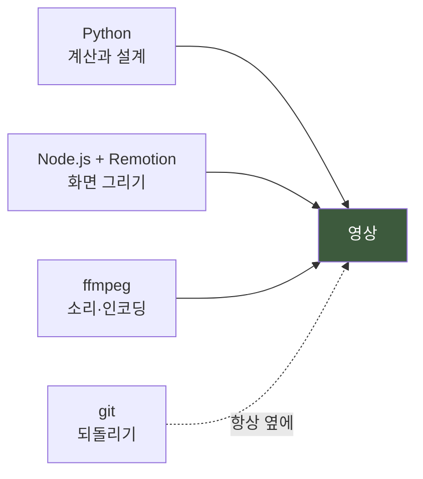

| 도구 | 무엇을 하나 | 왜 필요한가 |
|---|---|---|
| **Python 3** | 설계도를 만들고 소리·그림을 잽니다 | **뼈대**를 이것으로 만듭니다 |
| **Node.js + Remotion** | 화면을 그려 영상으로 만듭니다 | **코드로 영상을 만드는 도구** |
| **ffmpeg** | 소리를 붙이고 형식을 바꿉니다 | **영상 작업의 만능 칼** |
| **git** | 바뀐 것을 기억하고 되돌립니다 | **되돌릴 수 있어야 과감해집니다** |

### 1.2 설치 (윈도우)

```bash
winget install --id Python.Python.3.12
winget install --id OpenJS.NodeJS.LTS
winget install --id Gyan.FFmpeg
winget install --id Git.Git
```

> **★ 깔고 나면 터미널을 반드시 새로 엽니다.**
> **새 창에서만 인식됩니다.** 이걸 몰라서 「설치했는데 안 된다」고
> 헤매는 경우가 가장 흔합니다.

### 1.3 잘 깔렸는지 확인

**넷 다 버전 숫자가 나와야 합니다.**

```bash
python --version
node --version
ffmpeg -version
git --version
```

### 1.4 파이썬 꾸러미

```bash
pip install numpy scipy Pillow requests
```

| 꾸러미 | 무엇 |
|---|---|
| `numpy` · `scipy` | **숫자 계산.** 소리와 그림을 재는 데 씁니다 |
| `Pillow` | **그림 다루기** |
| `requests` | **인터넷으로 요청 보내기.** AI 도구를 쓸 때만 |

### 1.5 있으면 좋은 것

| 도구 | 언제 |
|---|---|
| `rclone` | 큰 파일을 클라우드에 올릴 때 |
| `gh` | GitHub 을 명령으로 다룰 때 |

---

## 2. 빠른 시작 — 30분 만에 8초짜리 만들어 보기

**전체를 이해하기 전에 한 바퀴 돌려 보는 것이 가장 빠릅니다.**

### 2.1 Remotion 프로젝트 만들기

```bash
mkdir 내영상 && cd 내영상
npm init -y
npm install remotion @remotion/cli react react-dom
```

### 2.2 파일 셋 만들기

**`src/index.jsx`**

```jsx
import { registerRoot } from "remotion";
import { Root } from "./Root.jsx";
registerRoot(Root);
```

**`src/Root.jsx`**

```jsx
import { Composition } from "remotion";
import { 영상 } from "./Video.jsx";

export const Root = () => (
  <Composition id="test" component={영상}
    durationInFrames={240} fps={30} width={1920} height={1080} />
);
```

**`src/Video.jsx`**

```jsx
import { AbsoluteFill, Img, staticFile, useCurrentFrame } from "remotion";

export const 영상 = () => {
  const 프레임 = useCurrentFrame();
  // 8초 동안 1.0배 → 1.12배로 천천히 커진다 (켄번스)
  const 배율 = 1 + (프레임 / 240) * 0.12;
  return (
    <AbsoluteFill style={{ backgroundColor: "#07090E" }}>
      
    </AbsoluteFill>
  );
};
```

### 2.3 사진 한 장 넣고 굽기

```bash
mkdir public
# public/사진.jpg 에 아무 사진이나 하나 넣습니다

npx remotion render src/index.jsx test out/시험.mp4
```

**`out/시험.mp4` 가 생기면 성공입니다.** 8초 동안 사진이 천천히 커집니다.

> **여기까지 되면 나머지는 전부 「이것을 크게 만드는 일」**입니다.

---

## 3. 폴더를 만듭니다

### 3.1 이 구조를 권합니다

```
내프로젝트/
├─ 00. 기획서.md              ← 무엇을 왜 만드나
├─ 01. 할 일.md               ← 작업 목록
├─ 04. 개정 이력.md           ← 언제 무엇이 바뀌었나
│
├─ 사진/                      ← 원본. git 에 안 넣는다
├─ 음악/                      ← 원본. git 에 안 넣는다
│
├─ 도구/                      ← 파이썬 스크립트
├─ 영상프로젝트/              ← Remotion
│   ├─ src/
│   └─ public/                ← 사진·음악의 사본. git 에 안 넣는다
│
├─ 산출물/                    ← 날짜별. 큰 파일은 클라우드
│   └─ 20260825 - 첫 판/
│       └─ README.md          ← 이것만 git 에
│
├─ 백업/                      ← 문서 스냅샷
└─ 기록/                      ← 하루하루
```

### 3.2 `.gitignore` — **큰 파일을 막습니다**

**「gitignore」는 「버전 관리에 넣지 않을 것 목록」**입니다.

```
# 큰 파일 — 클라우드가 갖는다
*.mp4
*.mov
*.wav
*.mp3
*.flac

# 사진 원본과 그 사본
사진/
영상프로젝트/public/
산출물/**/*.jpg
산출물/**/*.png

# 프로그램이 만드는 것
node_modules/
__pycache__/
영상프로젝트/out/

# 비밀
.env
```

> **★ 왜 영상을 git 에 안 넣나** — **git 은 한 번 넣은 파일을 영원히 기억합니다.**
> 400 MB 영상을 열 판 넣으면 **4 GB 가 영원히 남고**, 대부분의 저장소는
> **파일 하나에 100 MB 한도**가 있습니다.

### 3.3 git 시작하기

```bash
git init
git add -A
git commit -m "시작"
```

---

## 4. 1단계 — 음악을 끝냅니다

### 4.1 ★ 규칙 하나

> **음악이 완전히 끝나기 전에 영상을 만들지 않습니다.**

**영상은 음악의 시간 위에 놓입니다.** 음악이 1초만 바뀌어도 **모든 컷이 밀립니다.**

**이 프로젝트는 음악이 9분 40초에서 10분 19.84초로 바뀌었습니다.**
영상을 먼저 만들었다면 통째로 버렸을 것입니다.

### 4.2 음악에서 뽑아 둘 것 둘

| 무엇 | 왜 |
|---|---|
| **전체 길이 (초 단위, 소수점까지)** | 뼈대의 기준입니다 |
| **구간 경계** | 곡이 바뀌는 자리. **영상도 여기서 바뀌어야 합니다** |

**길이는 이렇게 잽니다.**

```bash
ffprobe -v error -show_entries format=duration -of csv=p=0 "음악/전곡.wav"
```

### 4.3 구간 경계를 정하는 법

**귀로 찍어도 되고 도구로 찾아도 됩니다.** 처음이면 **귀로 찍고 표로 적으십시오.**

```
0    ~ 70.53   도입
70.53 ~ 128.50  1부
...
```

**이 표가 뒤의 모든 것의 기준**이 됩니다. **한 곳에만 적습니다**(정본 하나).

### 4.4 곡을 AI 로 만든다면

**Suno 같은 도구로 곡을 만들 생각이면 여기가 그 자리입니다.**
**방법과 함정은 [10.2 절](#102-소리-쪽--suno-같은-도구로-곡을-만든다)에 있습니다.**

> **★ 화면 쪽 AI 보다 반드시 먼저 끝냅니다.**
> 곡이 바뀌면 **모든 컷의 시각이 밀리기** 때문입니다.

---

## 5. 2단계 — 사진을 정리합니다

### 5.1 먼저 세어 봅니다

**「몇 장인가」가 의외로 어렵습니다.** 이 프로젝트는 **253장 → 245장 → 244장**으로
두 번 정정했습니다. 저해상도 사본과 보정본이 섞여 있었습니다.

**세는 도구를 하나 만듭니다.** 파일마다 이것을 적습니다.

| 칸 | 왜 |
|---|---|
| **폴더** | **★ 서로 다른 폴더에 이름이 같은 파일이 있을 수 있습니다** |
| 파일 이름 | |
| 너비 · 높이 | **가로인가 세로인가**가 화면 배치를 가릅니다 |
| 밝기 | 어두운 것부터 쓰는 구간이 있을 수 있습니다 |
| 등급 | 아래 |

> **★ 「폴더」 칸을 빠뜨리지 마십시오.** 이 프로젝트는 **두 도시에 이름이 같은
> 사진이 열 장** 있었습니다. 2005년 카메라의 일련번호가 한 바퀴 돈 것입니다.
> **파일 이름만으로 찾으면 열 장이 엉뚱한 곳에 나갑니다.**

### 5.2 등급을 매깁니다

**눈으로 합니다. 도구가 못 합니다.**

| 등급 | 뜻 |
|---|---|
| **A** | 꼭 쓴다 |
| **B** | 써도 된다 |
| **C** | **쓰지 않는다** |

**C 로 빼는 이유를 반드시 적습니다.**

| 흔한 C 사유 |
|---|
| **모르는 사람의 얼굴이 또렷하다** — 공개하는 작품이면 위험합니다 |
| **남의 작품이 화면 대부분이다** — 그림·조각·공연 |
| 흔들렸거나 초점이 나갔다 |
| 같은 장면이 여러 장이다 |

### 5.3 표는 손으로 고치지 않습니다

**세는 도구가 만들고, 등급만 사람이 채웁니다.**
**두 곳에 적으면 반드시 어긋납니다.**

---

## 6. 3단계 — 뼈대를 만듭니다

### 6.1 뼈대가 무엇인가

> **「어느 그림이 몇 초에 몇 초 동안 나오는가」를 전부 적은 파일 하나.**

**이 파일만 보면 영상이 무엇을 보여주는지 전부 알 수 있어야 합니다.**

```json
{
  "총길이": 619.84,
  "fps": 30,
  "컷": [
    { "시작": 12.0, "길이": 4.2, "종류": "단일", "사진": ["사진/a.jpg"] },
    { "시작": 16.2, "길이": 4.2, "종류": "멀티패널", "사진": ["사진/b.jpg", "사진/c.jpg"] }
  ]
}
```

### 6.2 ★ 한 컷이 몇 초인가 — **거꾸로 정합니다**

**흔한 방식** — 사진 수로 음악 길이를 나눕니다.
**그러면 어떤 구간은 한 장에 1초, 어떤 구간은 7초**가 됩니다.
**1초는 「봤다」가 안 되고 7초는 지루합니다.**

**이 프로젝트가 쓴 방식은 반대입니다.**

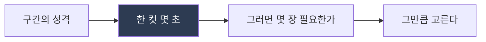

| 구간의 성격 | 한 컷 |
|---|---|
| 가장 조용한 곳 | **8.58초** — 오래 머문다 |
| 가장 격렬한 곳 | **3.04초** — 빨리 넘어간다 |

**남는 사진이 생기는 것은 손해가 아닙니다.** 고를 여지입니다.

### 6.3 세로 사진 다루기

**가로 화면(16:9)에 세로 사진을 넣으면 양옆이 크게 빕니다.**

**두 가지 방법이 있습니다.**

| 방법 | 언제 |
|---|---|
| **두 장을 나란히** (멀티패널) | 세로가 많을 때. **한 화면에 두 장을 담아 더 많이 보여줍니다** |
| **한 장을 온전히 + 뒤에 흐린 배경** | **중요한 사진.** 자기 자신을 크게 흐려서 뒤에 깝니다 |

### 6.4 ★★ 잘라내지 마십시오

**가장 흔하고 가장 아까운 실수입니다.**

**4:3 사진을 16:9 화면에 꽉 채우면 위아래 25%가 사라집니다.**
**인물 사진이면 발밑과 머리 위가 없어집니다.**

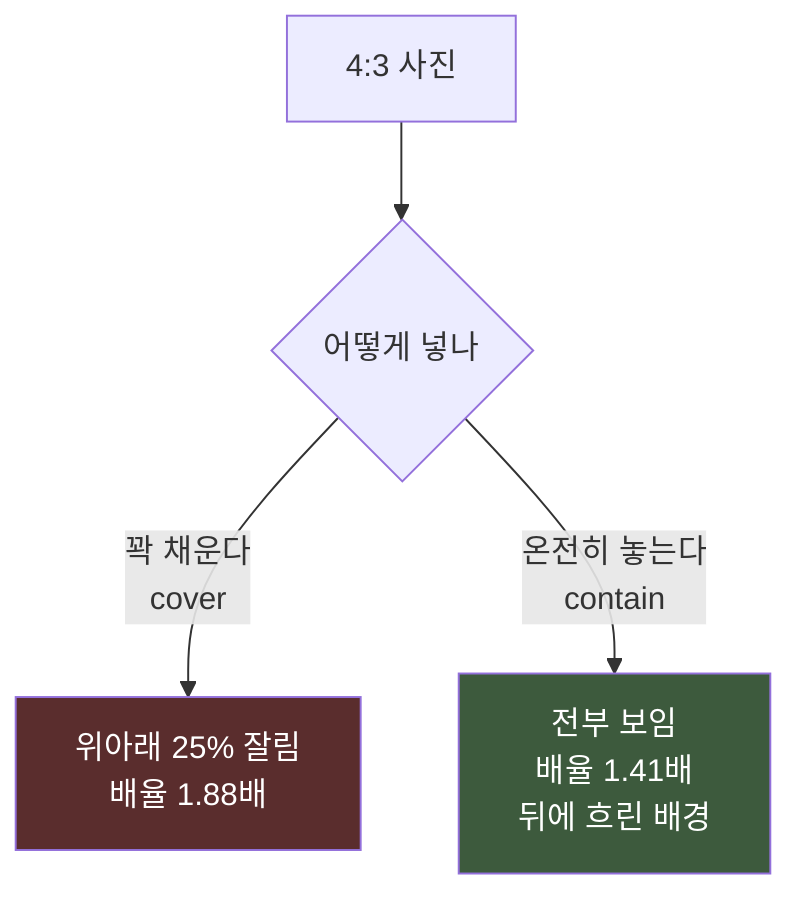

**온전히 놓으면 늘어나는 배율도 작아서 덜 뭉갭니다.**

### 6.5 뼈대 도구에 자기검사를 답니다

**이것이 이 가이드에서 가장 중요한 한 줄입니다.**

**최소 다섯 개를 권합니다.**

| # | 검사 | 왜 |
|---|---|---|
| 1 | **시간을 빈틈없이 덮는가** | 구멍이 있으면 검은 화면이 나옵니다 |
| 2 | **컷이 자기 구간 안에 있는가** | 경계를 넘으면 음악과 안 맞습니다 |
| 3 | **쓴 사진이 목록 안에 있는가** | **오타를 잡습니다** |
| 4 | **한 사진을 두 번 썼으면 표시했는가** | |
| 5 | **한 컷이 너무 짧거나 길지 않은가** | |

> **★ 하나라도 미달이면 파일을 안 냅니다.**
> 경고만 찍고 파일을 내면 아무도 안 봅니다. **멈춰야 봅니다.**

**이 프로젝트에서 3번이 실제로 진짜 버그를 잡았습니다** — 위 5.1절의
「두 도시에 같은 이름」이 그것입니다. **안 잡았으면 영상을 다 굽고 나서야
눈으로 발견했을 것**입니다.

---

## 7. 4단계 — 화면을 그립니다

### 7.1 ★ 정하는 쪽과 그리는 쪽을 나눕니다

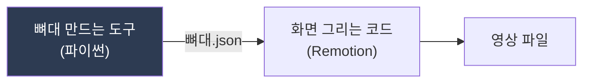

| | 무엇을 하나 | 무엇을 안 하나 |
|---|---|---|
| **정하는 쪽** | 어느 그림이 몇 초에 | **아무것도 안 그린다** |
| **그리는 쪽** | 화면을 그린다 | **아무것도 안 정한다** |

**왜 나누나** — **배치를 바꾸려면 어디를 고쳐야 하는지가 하나로 정해집니다.**
섞어 두면 **「이 사진은 3초」 같은 것이 그리는 코드 여기저기에 흩어집니다.**

### 7.2 켄번스 — 사진을 천천히 움직입니다

**「켄번스(Ken Burns)」는 정지 사진을 천천히 확대하거나 옆으로 흘리는 것**입니다.
**이것 하나로 사진이 「영상처럼」 보입니다.**

```jsx
const 프레임 = useCurrentFrame();
const { durationInFrames } = useVideoConfig();
const t = 프레임 / durationInFrames;          // 0 에서 1 로

const 배율 = 1 + t * 0.12;                    // 12% 커진다
const 옆 = t * 2.0;                           // 옆으로 2% 흐른다
// transform: `scale(${배율}) translateX(${옆}%)`
```

> **★ 방향을 난수(랜덤)로 정하지 마십시오.**
> **구울 때마다 달라져서 「어제 것과 뭐가 달라졌나」를 못 가립니다.**
> **컷 번호로 정합니다** — `i % 6` 처럼.

### 7.3 컷과 컷 사이

**딱 잘라 붙이면 튑니다.** **아주 짧게 검은색을 겹칩니다.**

| 자리 | 길이 |
|---|---|
| 보통 컷 사이 | **0.1~0.4초** |
| **구간이 바뀌는 자리** | **0.8초** — 길게 |

### 7.4 영상 컷도 넣을 수 있습니다

**사진 자리에 짧은 영상을 넣을 수 있습니다.**

```jsx
import { OffthreadVideo } from "remotion";
// <OffthreadVideo src={...} muted style={{...}} />
```

**두 가지만 주의합니다.**

| | |
|---|---|
| **켄번스를 주지 마십시오** | 영상이 이미 움직입니다. 겹치면 멀미가 납니다 |
| **`muted`** | 소리는 나중에 마스터에서 붙입니다. 여기서 나오면 겹칩니다 |

---

## 8. 5단계 — 굽습니다

### 8.1 ★★ 소리를 같이 넣지 마십시오

**가장 중요한 절입니다.**

**Remotion 이 소리를 같이 넣으면 소리가 42.67 밀리초 늦습니다.**
소리를 압축하는 방식(AAC)이 앞에 빈 것을 넣는데, 그만큼 밀립니다.
**점점 벌어지는 게 아니라 처음부터 끝까지 딱 그만큼** 늦습니다.

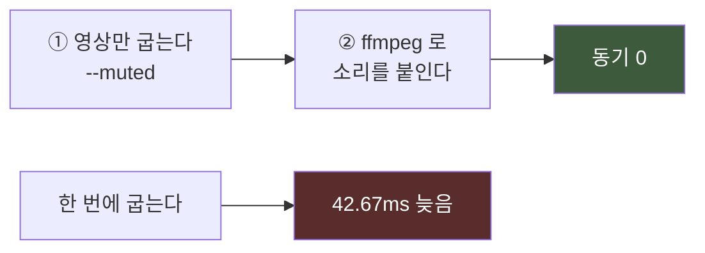

### 8.2 ① 영상만 굽기

```bash
cd 영상프로젝트
npx remotion render src/index.jsx jeongok "out/영상만.mp4" \
  --codec=h264 --crf=20 --muted
```

| 옵션 | 뜻 |
|---|---|
| `--muted` | **소리 없이** |
| `--crf=20` | **화질.** 낮을수록 좋고 큽니다. 18~23 이 보통 |

**10분에 20~35분 걸립니다.** 영상 컷이 있으면 더 걸립니다.

### 8.3 ★ 색 범위 — 안 맞추면 색이 뜹니다

**기본으로 나오는 색 범위가 유튜브 규격과 다릅니다.**

**`remotion.config.js` 에 이 줄을 넣습니다.**

```js
import { Config } from "@remotion/cli/config";
Config.setColorSpace("bt709");
```

> **명령줄 옵션(`--pixel-format`)으로는 안 고쳐집니다.**
> **이것 하나만 듣습니다.** 실측했습니다.

### 8.4 ② 소리 붙이기 + 선명하게

```bash
ffmpeg -y -i "out/영상만.mp4" -i "../음악/전곡.wav" \
  -vf "unsharp=5:5:1.0:5:5:0" \
  -map 0:v -map 1:a \
  -c:v libx264 -preset veryfast -crf 20 -profile:v high -level 4.1 \
  -pix_fmt yuv420p -color_range tv -colorspace bt709 \
  -color_primaries bt709 -color_trc bt709 -r 30 -g 60 \
  -c:a aac -b:a 384k -ar 48000 -ac 2 \
  -shortest -movflags +faststart "out/완성.mp4"
```

**약 3분 30초입니다.**

> **★ 선명하게 하는 것을 화면 그리는 코드에서 하지 마십시오.**
> **매 프레임마다 걸려서 렌더가 22분에서 76분이 됩니다.**
> **ffmpeg 는 인코딩하면서 한 번에 합니다.** 결과는 거의 같습니다.

**`unsharp` 의 세 번째 숫자(`1.0`)가 세기입니다.** 과하면 낮춥니다 —
**영상을 다시 굽지 않고 이 명령만 다시 돌리면 됩니다.**

### 8.5 워터마크

**같은 명령에 한 줄 더합니다. 값도 시간도 거의 안 듭니다.**

```bash
  -vf "unsharp=5:5:1.0:5:5:0,drawtext=fontfile='C\:/Windows/Fonts/malgun.ttf':textfile='워터마크.txt':fontcolor=white@0.35:fontsize=30:x=w-tw-46:y=h-th-40:shadowcolor=black@0.4:shadowx=1:shadowy=1" \
```

> **글자는 파일에 적어서 줍니다** (`textfile=`).
> **`©` 같은 글자를 명령에 직접 쓰면 깨집니다.**

### 8.6 ★ 이어 붙일 때 — 소리를 다시 붙입니다

**끝에 무언가를 이어 붙이려면 조심해야 합니다.**

**그냥 이으면 소리가 21.33 밀리초 밀립니다.** 이어 붙이는 기능이
**소리 보정을 날려 버리기** 때문입니다.

```bash
# ① 영상만 잇는다 (둘 다 소리 없이 만들어 둔 것)
printf "file '앞.mp4'\nfile '뒤.mp4'\n" > 목록.txt
ffmpeg -y -f concat -safe 0 -i 목록.txt -i "../음악/전곡.wav" \
  -filter_complex "[1:a]apad=pad_dur=12[a]" \
  -map 0:v -map "[a]" -c:v copy -c:a aac -b:a 384k -ar 48000 -ac 2 \
  -shortest -movflags +faststart "out/최종.mp4"
```

**`apad` 는 「소리가 모자라면 뒤에 무음을 붙여라」**입니다.

---

## 9. 6단계 — 검증합니다

### 9.1 반드시 재는 것 셋

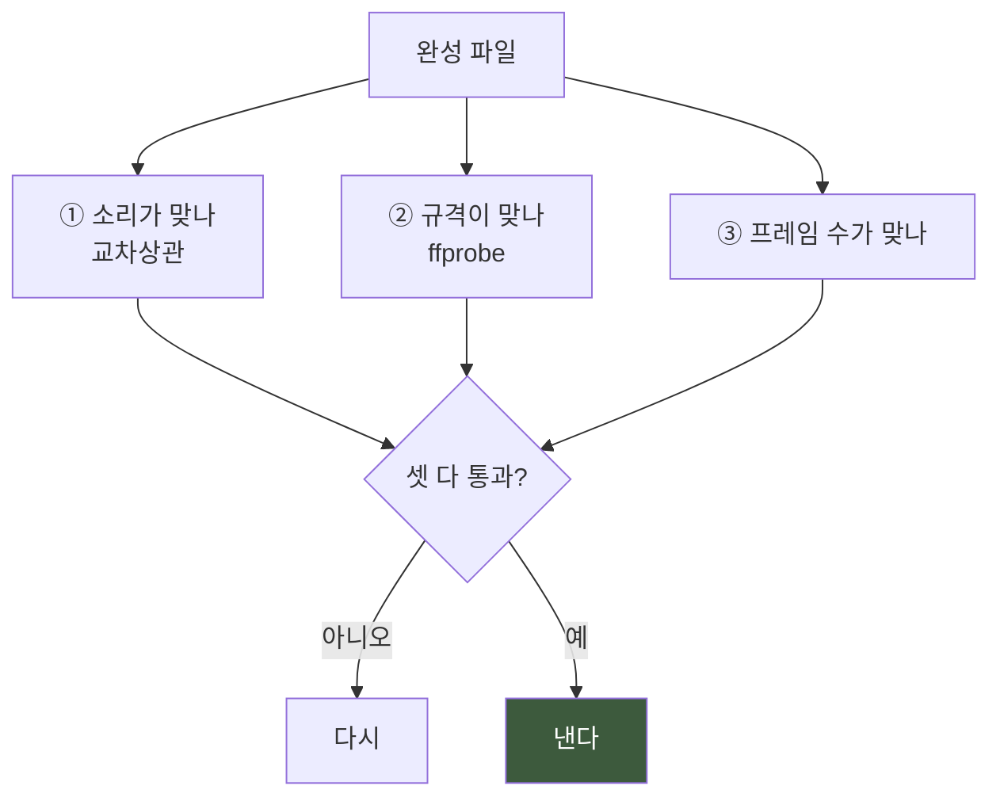

### 9.2 ① 소리가 맞나

**영상에서 소리를 다시 뽑아 원본과 견줍니다.**

```bash
ffmpeg -y -i "out/완성.mp4" -vn -acodec pcm_s16le "확인.wav"
```

**여러 지점에서 재고, 전 지점이 0 이어야 합니다.**

> **한 지점만 재면 안 됩니다.** 이어 붙인 자리에서만 틀릴 수 있습니다.

### 9.3 ② 규격이 맞나

```bash
ffprobe -v error -select_streams v \
  -show_entries stream=codec_name,profile,width,height,r_frame_rate,pix_fmt,color_range,color_space,nb_frames \
  -show_entries format=duration,size -of default=nw=1 "out/완성.mp4"
```

**유튜브 규격 — 이렇게 나와야 합니다.**

| 항목 | 값 |
|---|---|
| 영상 | H.264, `profile=High` |
| 크기 | 1920×1080 / 30 fps |
| 색 | `pix_fmt=yuv420p` · `color_range=tv` · `color_space=bt709` |
| 소리 | AAC 384 kbps / 48000 Hz / 2채널 |

> **`profile=Constrained Baseline` 이 나오면 `-preset ultrafast` 로 구운 것입니다.**
> **파일이 3배 커집니다.** `veryfast` 로 다시 구우십시오.

### 9.4 ③ 눈으로 봅니다

**숫자로는 레이아웃이 깨진 것을 못 잡습니다.**

```bash
# 구간이 바뀌는 자리마다 한 장씩
for T in 22 168 281 430 570; do
  ffmpeg -v error -y -ss $T -i "out/완성.mp4" -frames:v 1 "확인_$T.png"
done
```

**이 프로젝트에서 이것이 두 가지를 잡았습니다** — 도입부에 마지막 도시가 나온 것,
벽화 위에서 글자가 안 보인 것. **숫자로는 못 봤을 것들입니다.**

### 9.5 ★ 큰 것을 굽기 전에 작은 것으로

**35분짜리를 굽고 나서 틀린 것을 아는 일을 하지 마십시오.**

```bash
# 한 장만
npx remotion still src/index.jsx jeongok out/확인.png --frame=2180

# 300프레임만 (10초)
npx remotion render src/index.jsx jeongok out/짧게.mp4 --frames=0-299 --muted
```

---

## 10. 7단계 — AI 로 더합니다

### 10.1 ★ AI 가 들어오는 자리는 **둘**입니다

**「AI 로 뮤직비디오를 만든다」는 말은 실제로는 서로 다른 두 가지 일**입니다.
**값도, 위험도, 다루는 법도 다릅니다.**

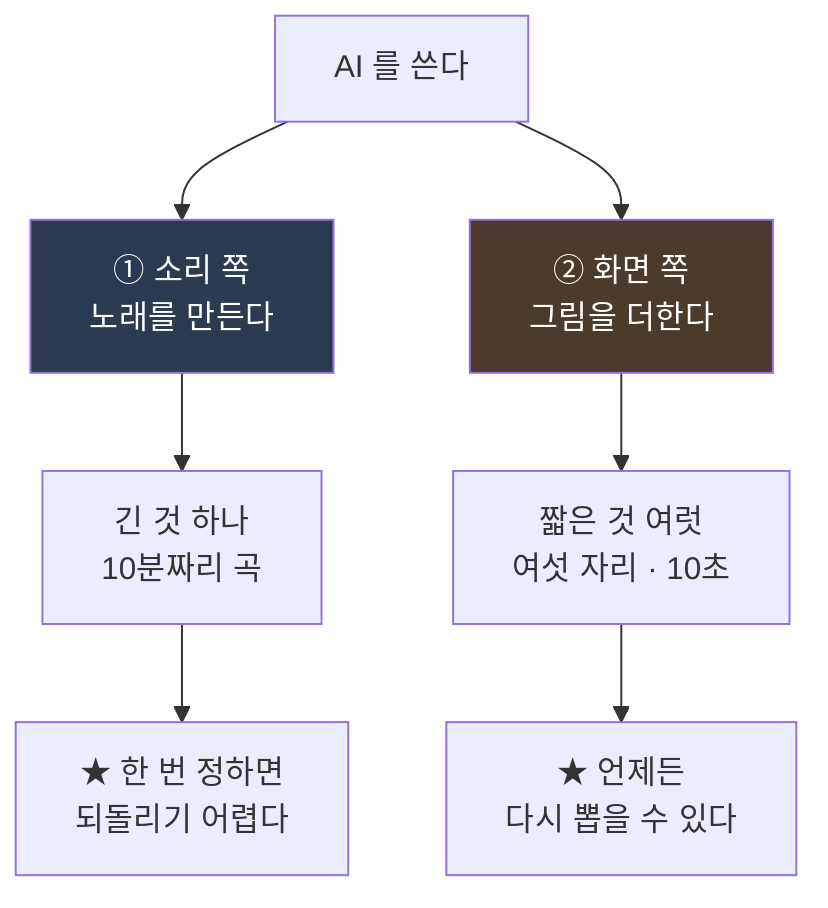

| | **① 소리 쪽** | **② 화면 쪽** |
|---|---|---|
| 도구 예 | **Suno** · Udio | 이미지 편집 · 영상 생성 |
| 나오는 것 | **곡 전체** (조각으로) | **장면 하나** |
| 값 | **월 구독** (대개) | **건당** |
| 다시 뽑기 | **곡이 통째로 달라진다** | **그 장면만 바뀐다** |
| 언제 정하나 | **1단계**(4절) — 가장 먼저 | **7단계** — 가장 나중 |

> **★ 순서를 지키십시오.** 소리가 확정되기 전에 화면 쪽 AI 를 쓰면
> **곡이 바뀔 때 그 그림들이 서 있던 시각이 전부 밀립니다.**

**10.2~10.3 이 소리 쪽, 10.4 부터가 화면 쪽**입니다.

---

### 10.2 소리 쪽 — Suno 같은 도구로 곡을 만든다

#### 무엇을 하는 도구인가

**글로 설명을 써 주면 노래를 만들어 줍니다.** 반주도, 목소리도, 가사도.

**그런데 이 프로젝트가 쓴 방식은 조금 다릅니다.**

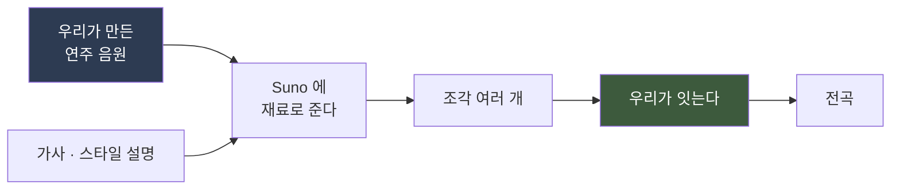

**「우리가 만든 음원을 재료로 준다」가 핵심**입니다.
**빈 종이에서 시키면 우리 곡이 아니라 그 도구의 곡이 나옵니다.**

이 프로젝트는 **화성·선율·편성을 전부 직접 만들어 놓고**,
Suno 에는 **「이 소리를 참고해서 이런 목소리를 얹어 달라」**고 시켰습니다.

| 설정 | 뜻 |
|---|---|
| **참고 강도** | **원본을 얼마나 따라갈 것인가.** 이 프로젝트는 **80%** 로 뒀습니다 |
| 스타일 설명 | 악기·분위기·시대. **조각마다 다르게** 줍니다 |
| 가사 | **구간 표시**(`[Verse]` 같은 것)를 함께 |

#### ★ 왜 「조각」으로 오나

**이런 도구들은 대개 한 번에 몇 분까지만 만듭니다.**
**10분짜리는 한 번에 안 나옵니다.**

**그래서 「이어 만들기」 기능으로 뒤를 늘려 가는데, 여기에 함정이 셋 있습니다.**

| # | 함정 | 무슨 일이 나나 |
|---|---|---|
| **1** | **「그대로 두기」가 그대로 두는 게 아니다** | 앞부분을 「유지」로 표시해도 **다시 만들어 버립니다.** 이 프로젝트는 **높은 소리가 23 dB 깎여 나간 것**을 나중에 발견했습니다 |
| **2** | **길이 설정이 「이어 만들기」에서는 안 먹는다** | 5분을 달라고 해도 그것과 무관한 길이가 옵니다 |
| **3** | **부드럽게 잇는 기능이 길이를 먹는다** | 조각을 이을 때 겹치는 만큼 **전체가 짧아집니다** |

> **★ 그래서 「이어 만들기」로 나온 것을 그대로 믿지 마십시오.**
> **이어 붙일 때 반드시 재야 합니다** — 이 프로젝트는 도구를 하나 만들어서
> **조각 안에서 높은 소리가 5초 사이에 8 dB 이상 뛰면 그 시각을 찍게** 했습니다.
> **1번 함정을 놓친 뒤에 만든 것**입니다.

#### 조각을 이을 때 확인할 것 넷

| # | |
|---|---|
| 1 | **길이가 맞나** — 겹친 만큼 짧아졌을 수 있습니다 |
| 2 | **이음매에서 소리가 튀지 않나** |
| 3 | **★ 이음매에서 음색이 바뀌지 않나** — 위 1번 함정 |
| 4 | **구간 경계가 우리가 정한 자리와 맞나** |

**4번이 중요합니다.** **영상은 곡의 구간 경계에서 바뀌어야 하는데,
AI 가 만든 곡은 그 경계가 우리가 설계한 자리와 안 맞을 수 있습니다.**

**경계를 눈이 아니라 도구로 찾으십시오.** 이 프로젝트는 화성·음색·리듬
**세 갈래를 따로 재서 합치는** 도구를 만들었고, **자기 점수가 9점 만점에
8점 미만이면 결과를 안 내게** 했습니다.

> **앞서 만든 자 둘은 6점과 3점이었습니다.**
> **그 점수를 보고 나서야 「이 경계가 틀렸다」는 것을 알았습니다.**

#### 악기별로 나눠 받을 수 있습니다

**완성된 곡을 「드럼 / 베이스 / 목소리 / 나머지」로 나눠 주는 기능**이 있습니다.
**한 악기만 줄이고 싶을 때 씁니다.**

**다만 기대를 낮추십시오.** 이 프로젝트는 **어느 구간을 조용하게 되돌리려고**
썼는데 **못 했습니다** — **나누는 칸에 「현악」이 없었기** 때문입니다.

> **★ 그 실패가 더 큰 것을 알려줬습니다.**
> **「조용함」은 한 구간의 성질이 아니라 앞뒤 구간과의 낙차**였습니다.
> **그 구간만 줄여서는 안 되는 문제였습니다.**

#### ★ 만든 곡을 잃어버리지 마십시오

**같은 설명을 다시 넣어도 같은 곡이 안 나옵니다.**

| 반드시 할 것 |
|---|
| **나온 파일을 즉시 내려받아 보관합니다** |
| **곡마다 붙는 고유 번호(ID)를 적어 둡니다** — 나중에 그 번호로 되찾을 수 있습니다 |
| **안 고른 것도 보관합니다** — *"무엇과 비교해서 저것을 골랐는가"가 판정의 절반* |

**이 프로젝트는 스무 개를 뽑아 놓고 골랐습니다.**

#### 약관과 표기 — **미리 읽으십시오**

| 확인할 것 | 왜 |
|---|---|
| **상업적 이용이 되나** | 요금제마다 다릅니다 |
| **크레딧 표기 의무가 있나** | 있으면 설명란에 적어야 합니다 |
| **★ 플랫폼의 「AI 사용 표기」** | **유튜브는 「AI 로 만든 음악」을 표기 대상 예시에 명시**하고 있습니다. **정면으로 걸립니다** |

> **표기는 감점이 아닙니다.** 안 하고 걸리는 것이 감점입니다.

#### 그래서 소리 쪽 순서는 이렇습니다

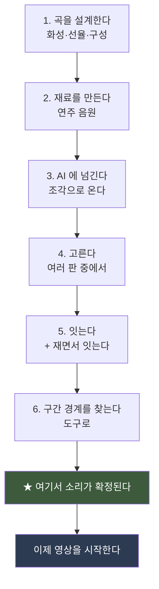

---

### 10.3 화면 쪽 — 여기부터는 그림 이야기입니다

**아래는 전부 「화면에 무엇을 더할 것인가」**입니다.
**소리가 확정된 뒤에 시작합니다**(10.1).

---

### 10.4 먼저 나눕니다

**「AI 를 쓴다」는 말이 너무 넓어서 판단이 안 됩니다.**

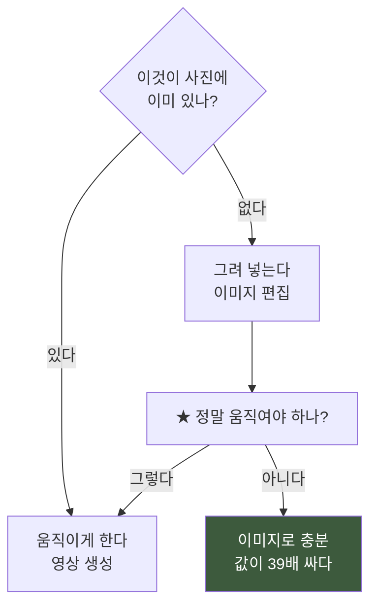

**실제 값** (2026년 8월 기준)

| | 값 |
|---|---|
| 영상 생성 (720p · 5초) | **약 $2.35** |
| 이미지 편집 (1K · 1장) | **약 $0.08** |

### 10.5 ★ 「움직여야 한다」고 넘겨짚지 마십시오

**이 프로젝트가 하루 만에 배운 것입니다.**

인물을 영상으로 네 편 만들었는데 **첫 프레임과 마지막이 거의 같았습니다.**
거의 안 움직이는 데 편당 $2.35 를 냈습니다.

**그리고 더 큰 것을 알았습니다.**

> **사진 속 사람들은 전부 정지해 있습니다. 하나만 움직이면 오히려 튑니다.**

### 10.6 프롬프트 쓰는 법 넷

| # | 규칙 | 왜 |
|---|---|---|
| **1** | **할 일을 먼저, 금지를 뒤에** | 금지를 앞에 몰면 **아무것도 안 합니다** |
| **2** | **금지를 반드시 적는다** | **시키지 않은 것을 합니다** |
| **3** | **범위를 좁혀서 준다** | 전체를 주면 **구도를 다시 잡습니다** |
| **4** | **결과를 계산으로 확인한다** | 「거의 같다」는 「그대로다」가 아닙니다 |

**3번의 예 — 실제로 이렇게 됐습니다.**

| | 우리가 놓은 자리 | 모델이 그린 자리 |
|---|---|---|
| 위치 | 화면 왼쪽 30% | **한가운데** |
| 크기 | 화면 높이의 12% | **45%** |

**인물이 설 칸만 잘라 보내니 옮길 데가 없어졌습니다.**

### 10.7 ★ 배경을 지키는 법

**이미지 편집 모델은 「그 부분만」 고치지 않습니다. 사진 전체를 다시 그립니다.**

**구조적으로는 99.25% 같았는데, 화소 단위로 보니 전체가 조금씩 다르고
화면의 36%가 달라져 있었습니다.**

**해결 — 필요한 부분만 오려서 손 안 댄 원본에 되붙입니다.**

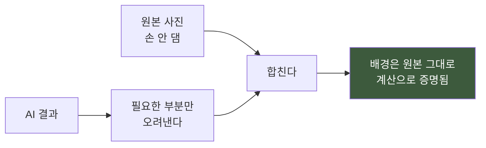

**오릴 자리는 짐작하지 말고 「우리가 아는 것」을 쓰십시오.**
**어디에 무엇을 넣으라고 지정한 것은 우리 자신입니다.**

### 10.8 돈이 나가는 도구에 다는 안전장치 셋

| # | |
|---|---|
| **1** | **「진짜로 보낸다」는 표시를 안 주면 아무것도 안 보낸다** |
| **2** | **보내기 전에 값을 찍고 멈춘다** |
| **3** | **★ 받은 것을 무조건 먼저 파일로 남긴다.** 해석은 그 다음 |

**3번이 사고에서 나왔습니다** — 요청은 정상으로 나갔고 만들어졌고 청구도 됐는데
**받는 코드가 틀려서 결과만 못 가져왔습니다.** **태운 돈의 27%가 이것**이었습니다.

### 10.9 사람 얼굴 주의

**대부분의 생성 서비스는 실제 사람의 얼굴이 든 사진을 거부합니다.**

**거부는 만들기 전에 나므로 돈은 안 듭니다.**
**잘라내거나 다른 사진을 쓰십시오.**

---

## 11. 자주 쓰는 명령 모음

### 11.1 확인

```bash
# 길이·규격 한 번에
ffprobe -v error -show_entries format=duration,size \
  -show_entries stream=codec_name,profile,width,height,r_frame_rate,pix_fmt \
  -of default=nw=1 "영상.mp4"

# 특정 시각의 한 장
ffmpeg -v error -y -ss 170 -i "영상.mp4" -frames:v 1 "확인.png"

# 마지막 프레임
ffmpeg -v error -y -sseof -0.15 -i "영상.mp4" -frames:v 1 "끝.png"
```

### 11.2 만들기

```bash
# 한 장만 (몇 초)
npx remotion still src/index.jsx jeongok out/확인.png --frame=2180

# 화면에서 만져 보기
npx remotion studio

# 전곡 (소리 없이)
npx remotion render src/index.jsx jeongok out/영상만.mp4 --codec=h264 --crf=20 --muted
```

### 11.3 고치기

```bash
# 소리만 바꿔 끼우기
ffmpeg -y -i "영상.mp4" -i "새소리.wav" -map 0:v -map 1:a -c:v copy \
  -c:a aac -b:a 384k -ar 48000 -ac 2 -shortest "새영상.mp4"

# 일부만 잘라내기 (10초부터 20초)
ffmpeg -y -ss 10 -t 20 -i "영상.mp4" -c copy "조각.mp4"

# 크기 바꾸기
ffmpeg -y -i "작은.mp4" -vf "scale=1920:1080" -c:a copy "큰.mp4"
```

### 11.4 클라우드

```bash
rclone copy "산출물" "drive:" --progress
# ★ 끝났는지는 이것으로 확인합니다
rclone check "산출물" "drive:" --one-way
```

> **`copy` 의 진행률은 「끝났다」의 증거가 아닙니다.**
> **큰 파일은 전송 중에 끊겨도 그 숫자로 남습니다.**

---

## 12. 문제가 생기면

### 12.1 증상별

| 증상 | 원인 | 해결 |
|---|---|---|
| **소리가 살짝 늦다** | Remotion 이 소리를 같이 넣었다 | **영상만 굽고 ffmpeg 로 붙인다** (8.1) |
| **이어 붙인 뒤 소리가 밀렸다** | 잇는 기능이 보정을 날렸다 | **영상만 잇고 소리는 다시** (8.6) |
| **색이 뜬다** | 색 범위가 안 맞다 | **`Config.setColorSpace("bt709")`** (8.3) |
| **파일이 너무 크다** | `ultrafast` 로 구웠다 | `veryfast` 로 다시 |
| **렌더가 갑자기 3배 느려졌다** | 화면 그리는 코드에 필터를 걸었다 | **ffmpeg 로 옮긴다** (8.4) |
| **사진 위아래가 잘린다** | 꽉 채우기(`cover`) | **온전히 놓기(`contain`)** (6.4) |
| **구울 때마다 조금씩 다르다** | 난수를 썼다 | **컷 번호로 정한다** (7.2) |
| **깔았는데 명령이 없다** | 터미널이 옛 창이다 | **새로 연다** (1.2) |
| **한글이 깨진다** | 인코딩 | `PYTHONUTF8=1` 을 앞에 붙인다 |
| **AI 가 얼굴 때문에 거부한다** | 내용 정책 | **잘라내거나 다른 사진** (10.6) |

### 12.2 ★ 「고쳤는데 안 고쳐졌을 때」

**가장 무서운 증상입니다. 아무 오류도 안 납니다.**

**이 프로젝트에서 실제로 있었습니다** — 파일을 고치는 스크립트가 중간에 죽었는데
**「고쳤다」고 보고했고**, 영상을 다시 구웠더니 **어제 것과 화면이 똑같았습니다.**

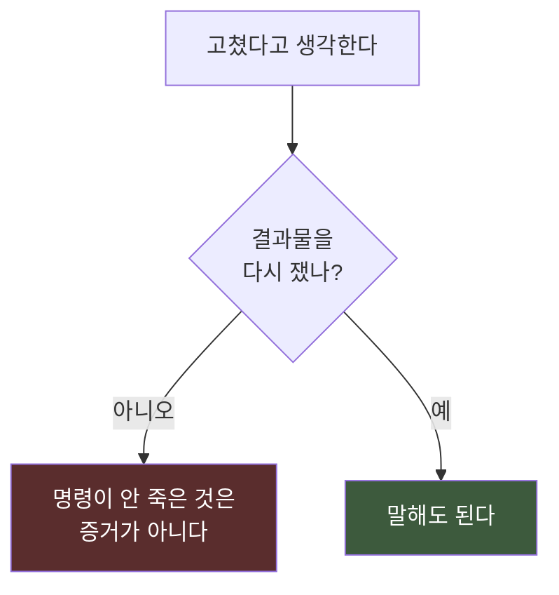

**확인하는 법.**

```bash
# 두 영상이 정말 다른지
ffmpeg -v error -y -ss 170 -i "옛.mp4" -frames:v 1 a.png
ffmpeg -v error -y -ss 170 -i "새.mp4" -frames:v 1 b.png
# 두 png 를 열어서 비교하거나, 파일 크기를 견줍니다
```

### 12.3 검사가 아무것도 안 잡을 때

**검사를 만들었으면 반드시 일부러 틀리게 해 보십시오.**

**이 프로젝트에서 「빠진 파일을 찾는 검사」를 만들고 통과를 봤는데,
시험 삼아 파일을 하나 빼 보니 「빠진 것 없음」이라고 찍었습니다.**

> **통과를 봤다는 것은 검사가 돈다는 뜻이 아닙니다.**

---

## 13. 파일을 어디에 두나

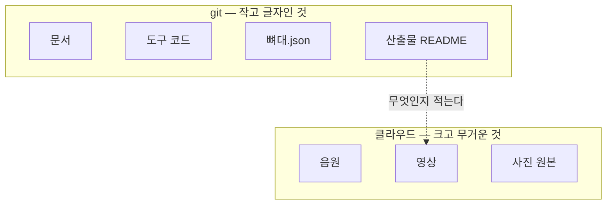

| 규칙 | |
|---|---|
| **큰 파일은 git 에 안 넣는다** | 영원히 남고 한도가 있습니다 |
| **클라우드에는 설명서도 같이** | **설명 없는 mp4 열 개는 쓸모가 없습니다** |
| **되돌릴 때 필요한 것은 git 에** | 코드가 있으면 다시 구울 수 있습니다 |
| **안 채택된 것도 안 지운다** | *"무엇과 비교해서 저것을 골랐는가"가 판정의 절반* |
| **승인된 것은 이름도 내용도 안 바꾼다** | 새 판은 **새 파일** |

**승인된 파일은 해시를 문서에 적어 둡니다.**

```bash
sha256sum "완성.mp4"
```

> **이름은 바뀌어도 해시는 안 바뀝니다.** 나중에 「이게 그때 그 파일 맞나」를
> 확인할 수 있는 유일한 방법입니다.

---

## 14. 자주 묻는 것

**Q. 10분짜리 하나 만드는 데 얼마나 걸립니까?**
**A.** 이 프로젝트는 **음악까지 포함해 스무하루**였습니다.
**영상만 놓고 보면 사흘**입니다 — 뼈대 하루, 다듬기 하루, AI 요소 하루.
**렌더 자체는 한 번에 20~35분**이고, 이 프로젝트는 **열네 번** 구웠습니다.

**Q. 사진이 몇 장 있어야 합니까?**
**A.** 10분에 **150~200장**이면 넉넉합니다. 이 프로젝트는 244장 중 **167장**을
썼습니다. **모자라면 한 장을 두 번 쓰기보다 한 컷을 길게 두는 편이 낫습니다.**

**Q. 컴퓨터가 좋아야 합니까?**
**A.** **렌더 시간에만 영향**을 줍니다. 느리면 오래 걸릴 뿐 결과는 같습니다.
다만 **메모리는 8 GB 이상**을 권합니다.

**Q. AI 없이도 됩니까?**
**A.** **됩니다.** 이 프로젝트도 영상의 **99%는 AI 가 아닙니다** —
사진을 코드로 천천히 움직인 것뿐입니다. **AI 는 여섯 자리와 에필로그에만**
썼고 **총 $17.5** 였습니다.

**Q. 판정해 줄 사람이 없습니다.**
**A.** **시간을 두는 것이 대안**입니다. 굽고 나서 **하루 묵혔다** 보십시오.
**다른 기기(휴대폰)에서 보는 것**도 효과가 큽니다 — 작은 화면에서
**안 보이는 것이 드러납니다.** 이 프로젝트도 그렇게 잡힌 것이 있습니다.

**Q. 여러 판을 만들어야 하면?**
**A.** **환경변수로 가릅니다.** 파일을 바꿔치기하면
**어느 것을 구웠는지 나중에 알 수 없습니다.**

```jsx
const 일반인가 = process.env.REMOTION_PAN === "일반";
const 뼈대 = 일반인가 ? 뼈대일반 : 뼈대기본;
```

```bash
REMOTION_PAN=일반 npx remotion render ...
```

**Q. 무엇부터 시작할까요?**
**A.** **2절의 빠른 시작**입니다. 사진 한 장으로 8초를 만들어 보면
**나머지가 전부 「이것을 크게 만드는 일」**이라는 게 보입니다.

---

## 마지막으로 — 세 줄만 기억한다면

> **① 음악을 먼저 끝냅니다.** 영상은 음악의 시간 위에 놓입니다.
>
> **② 소리는 따로 붙입니다.** 같이 구우면 42.67 밀리초 늦습니다.
>
> **③ 결과물을 다시 재서 말합니다.** 명령이 안 죽은 것은 증거가 아닙니다.

---

*작성 일자: 2026-08-25 · v5.17*
